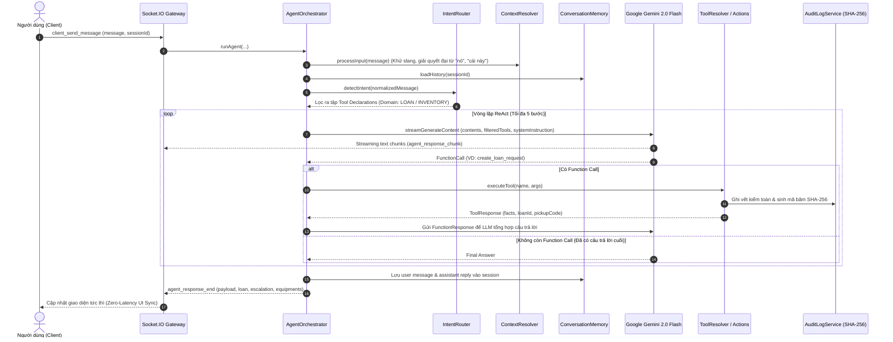

# EquipReferee AI Agent Engine — Core Architecture
> **Module:** `backend/modules/ai-agent`  
> **Kiến trúc:** ReAct Loop (Reasoning + Action) · Multi-turn Context · Dual-Path WebMCP · Google Gemini 2.0 Flash  
> **Định vị:** Bộ não điều phối tự hành của đề tài *"The Escalation Referee"* tại MLAI Hackathon 2026.

---

## 1. CẤU TRÚC PHÂN HỆ AI AGENT

```
backend/modules/ai-agent/
├── index.js                    # Entry point: Export hàm runAgent và các tiện ích
│
├── core/                       # TRUNG TÂM SUY LUẬN & ĐIỀU PHỐI (ORCHESTRATION)
│   ├── AgentOrchestrator.js    # Vòng lặp ReAct loop, giải mã tool call, lặp tối đa 5 bước
│   ├── IntentRouter.js         # Phân tích ý định & lọc Tool Declarations theo Domain
│   └── PromptEngine.js         # Xây dựng System Instruction động chuẩn xác theo ngữ cảnh
│
├── llm/                        # KẾT NỐI MÔ HÌNH NGÔN NGỮ LỚN
│   └── GeminiStreamClient.js   # Kết nối Gemini 2.0 Flash qua SSE Streaming & Function Calling
│
├── memory/                     # QUẢN LÝ NGỮ CẢNH & PHIÊN HỘI THOẠI
│   ├── ContextResolver.js      # Tiền xử lý từ lóng (Slang) & giải quyết đại từ chỉ định
│   └── ConversationMemory.js   # Bộ nhớ phiên In-Memory với TTL 2 giờ
│
└── tools/                      # HỆ THỐNG CÔNG CỤ TỰ HÀNH (TOOLS)
    ├── AgentTool.js            # Lớp cơ sở (Base Class) chuẩn hóa Tool
    ├── ToolRegistry.js         # Đăng ký danh mục Tool Declarations gửi cho Gemini
    ├── ToolResolver.js         # Bộ điều phối thực thi tool qua Adapter phù hợp
    │
    ├── actions/                # THỰC THI NGHIỆP VỤ THỰC TẾ
    │   ├── equipmentTools.js   # Tra cứu kho, danh mục, thống kê thiết bị
    │   ├── loanTools.js        # Tạo phiếu tự duyệt, chuyển tiếp thẩm quyền, hoàn tác
    │   └── verifyTools.js      # Bộ chạy 5 Test Cases thực tế Verify Harness 90s
    │
    └── adapters/               # ĐẦU NỐI THỰC THI HAI LÀN ĐƯỜNG (DUAL-PATH)
        ├── LocalServiceAdapter.js # Làn 2: Thực thi fallback cục bộ trên Server
        └── WebMCPAdapter.js    # Làn 1: Ủy quyền thực thi trên Trình duyệt qua WebMCP
```

---

## 2. VÒNG LẶP SUY LUẬN ReAct (REASONING + ACTION LOOP)

Quy trình xử lý một truy vấn từ khi người dùng nhắn tin cho đến khi trả về giao diện:



---

## 3. CÁC THÀNH PHẦN CỐT LÕI (CORE COMPONENTS)

### 3.1. `AgentOrchestrator.js` — Nhạc trưởng điều phối
* Quản lý trạng thái phiên, xác thực danh tính người mượn hoặc cấp quyền khách truy cập (Guest).
* Điều phối hội thoại đa lượt (Multi-turn), tự động gắn kết lịch sử các câu chat trước đó vào ngữ cảnh.
* Đảm bảo an toàn vòng lặp: Giới hạn tối đa **5 iterations**, giãn cách 500ms giữa các vòng gọi để tránh lỗi quá tải API (Burst Rate Limit).
* Đóng gói payload trả về giao diện: `loan` (phiếu tự duyệt), `escalation` (ca chuyển tiếp BGK), `equipments` (danh sách thiết bị tìm thấy).

### 3.2. `IntentRouter.js` — Phân loại ý định & Tối ưu Token
* **Vấn đề:** Gửi toàn bộ danh sách tools cho mọi câu hỏi khiến chi phí token tăng cao và LLM dễ bị phân tâm gọi sai công cụ.
* **Giải pháp:** Sử dụng Rule-based Intent Matching để phát hiện domain:
  - `LOAN`: Khi văn bản chứa các từ: *"mượn"*, *"thuê"*, *"lấy"*, *"tạo phiếu"*, *"trả"*, *"gia hạn"*. $\rightarrow$ Chỉ gửi các tools liên quan đến mượn trả (`create_loan_request`, `escalate_loan_request`, `rollback_loan_request`).
  - `INVENTORY`: Khi văn bản chứa: *"kho"*, *"còn không"*, *"danh sách"*, *"tìm"*, *"có sẵn"*, *"xem đồ"*. $\rightarrow$ Chỉ gửi tools tra cứu kho (`search_equipment`, `get_equipment_stats`).
  - `UNKNOWN`: Gửi đầy đủ tools an toàn.

### 3.3. `PromptEngine.js` — Chỉ dẫn hệ thống động (Dynamic System Instruction)
* Thiết lập vai trò: **"EquipReferee AI — Trợ lý Trọng tài Tự hành Điều phối & Cấp phát Thiết bị Nội bộ"**.
* Nạp các quy tắc bất biến của Đề A:
  - **Quy tắc 1:** Thiết bị $\le 20.000.000\text{ VNĐ}$ và thời gian $\le 7\text{ ngày}$ $\rightarrow$ Tự động gọi `create_loan_request`.
  - **Quy tắc 2:** Thiết bị $> 20.000.000\text{ VNĐ}$ hoặc mượn $> 7\text{ ngày}$ $\rightarrow$ Bắt buộc gọi `escalate_loan_request`, tuyệt đối không được tự duyệt.
  - **Quy tắc 3:** Thiếu ngày trả hoặc mục đích $\rightarrow$ Dừng lại đặt câu hỏi làm rõ (`ASK_CLARIFICATION`), cấm đoán mò.
  - **Quy tắc 4:** Không tự bịa mã `modelId` hay tên thiết bị không có trong cơ sở dữ liệu.

### 3.4. `GeminiStreamClient.js` — Giao tiếp trực tiếp với Gemini 2.0 Flash
* Sử dụng trực tiếp Google Generative AI REST API (v1beta) hỗ trợ Server-Sent Events (SSE).
* Phương thức: `models/gemini-2.0-flash:streamGenerateContent?alt=sse`.
* Bắt các sự kiện streaming thời gian thực, tách chunk text để gửi về frontend, đồng thời tổng hợp các cấu trúc `functionCall` để gửi lại cho Orchestrator.

### 3.5. `ConversationMemory.js` & `ContextResolver.js` — Ngữ cảnh thông minh
* `ConversationMemory.js`: Lưu trữ session trong Map (RAM) với cơ chế tự động dọn dẹp sau 2 giờ không hoạt động (TTL 2h), bảo đảm tốc độ truy xuất mili-giây.
* `ContextResolver.js`: 
  - Khử từ lóng tiếng Việt bằng từ điển `slangDictionary.json`.
  - Phân giải đại từ: Khi người dùng nói *"cho mình mượn nó"* hoặc *"lấy con thứ 2"*, hệ thống tự động tra cứu `lastViewedEquipment` trong session và bổ sung siêu dữ liệu thiết bị vào prompt trước khi gọi LLM.

---

## 4. DANH MỤC CÔNG CỤ TỰ HÀNH (TOOLS SPECIFICATION)

| Tên Công Cụ (`name`) | Tham số đầu vào (`parameters`) | Chức năng nghiệp vụ | Hành động hệ thống |
| :--- | :--- | :--- | :--- |
| `search_equipment` | `query`, `category`, `availableOnly` | Tra cứu thiết bị trong kho MongoDB | Trả về danh sách thiết bị kèm hình ảnh, đơn giá, tồn kho khả dụng |
| `get_equipment_stats` | Không có | Lấy số liệu thống kê toàn bộ kho | Trả về: Tổng thiết bị, Sẵn sàng, Đang mượn, Đang bảo trì |
| `create_loan_request` | `equipmentName` hoặc `modelId`, `borrowerName`, `durationDays`, `purpose` | Tự động tạo phiếu mượn thường quy ($\le 20\text{M} \land \le 7\text{d}$) | Trừ kho, cấp mã nhận đồ `pickupCode`, ghi nhật ký kiểm toán SHA-256 |
| `escalate_loan_request` | `equipmentName` hoặc `modelId`, `reason`, `durationDays`, `totalEstimatedValue` | Chuyển tiếp ca vượt thẩm quyền (> 20M hoặc > 7 ngày) | Tạo phiếu trạng thái `ESCALATED_PENDING`, gửi thông báo đến Ban Giám Khảo |
| `rollback_loan_request` | `loanId`, `reason` | Hoàn tác quyết định mượn đồ | Thu hồi mã nhận đồ, cộng trả tồn kho, ghi AuditLog `ROLLBACK_LOAN` |
| `verify_harness_90s` | Không có | Chạy bộ kiểm thử tự động 90 giây | Gọi `runAgent()` thật qua 5 Test Cases chuẩn, chấm điểm tự động |

---

## 5. CƠ CHẾ HAI LÀN ĐƯỜNG (DUAL-PATH EXECUTION)

```
                            [YÊU CẦU THỰC THI TOOL]
                                       │
                      ┌────────────────┴────────────────┐
                      ▼                                 ▼
           [KIỂM TRA HỖ TRỢ WEBMCP]           [CLIENT KHÔNG HỖ TRỢ]
                      │                                 │
           ┌──────────┴──────────┐                      │
           ▼                     ▼                      │
     (Có hỗ trợ)           (Mất kết nối / Lag)          │
           │                     │                      │
           ▼                     │                      │
   ✅ LÀN 1: WEBMCP              │                      │
• Gửi RPC qua Socket            │                      │
• Trình duyệt thực thi trực tiếp│                      │
• Cập nhật DOM không cần reload  │                      │
                                 ▼                      ▼
                         🚨 LÀN 2: LOCAL SERVICE FALLBACK
                         • Backend gọi trực tiếp MongoDB / Service
                         • Đảm bảo tiến trình không bao giờ gãy đổ
```

* **Làn 1 (WebMCP Client):** Tận dụng chuẩn giao thức Web Model Context Protocol chạy trên trình duyệt người dùng (`document.modelContext`). AI gọi tool trực tiếp trên máy khách, số lượng tồn kho và phiếu mượn nhảy số tức thì mà không cần tải lại trang.
* **Làn 2 (Local Service Fallback):** Nếu người dùng tắt tab, rớt mạng hoặc trình duyệt không hỗ trợ WebMCP, backend tự động fallback sang `LocalServiceAdapter.js` thực thi trực tiếp trên database, ghi AuditLog đầy đủ.
