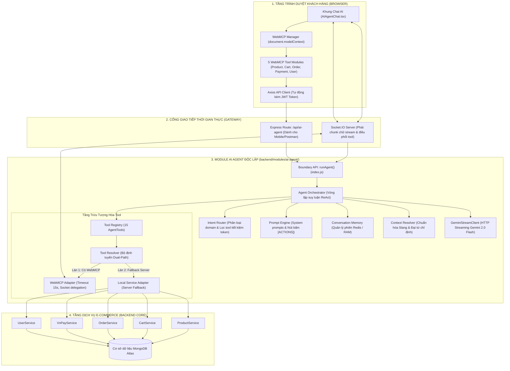
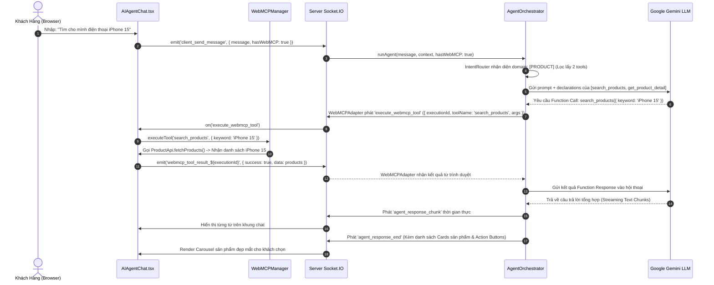
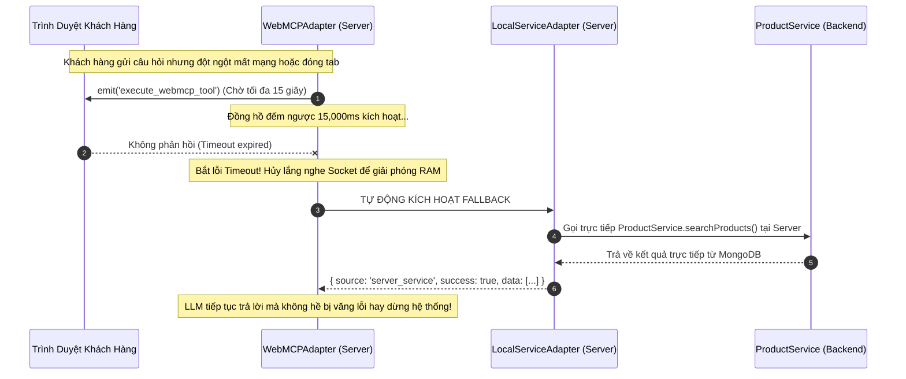

# HƯỚNG DẪN KIẾN TRÚC & SƠ ĐỒ LUỒNG HỆ THỐNG AI AGENT + WEBMCP
> **Dành cho Lập trình viên mới, Kỹ sư tích hợp và Đánh giá Đồ án Công nghệ phần mềm**  
> *Phiên bản kiến trúc: 2.0 (Clean Architecture & Dual-Path WebMCP Compliant)*

---

## MỤC LỤC
1. [Bản Chất WebMCP Cho Người Mới Bắt Đầu](#1-bản-chất-webmcp-cho-người-mới-bắt-đầu)
   - 1.1. WebMCP là gì? Nằm ở đâu trong trình duyệt?
   - 1.2. Làm thế nào để kết nối và kiểm tra WebMCP?
   - 1.3. Cơ chế giao tiếp RPC 2 chiều qua WebSocket
   - 1.4. So sánh: WebMCP Client vs Tool Server truyền thống
2. [Cấu Trúc Thư Mục & Vai Trò Từng File](#2-cấu-trúc-thư-mục--vai-trò-từng-file)
   - 2.1. Phía Frontend (`frontend/src/webmcp/`)
   - 2.2. Phía Backend (`backend/modules/ai-agent/`)
3. [Sơ Đồ Kiến Trúc & Code Sequence Chi Tiết](#3-sơ-đồ-kiến-trúc--code-sequence-chi-tiết)
   - 3.1. Sơ đồ khối phân tầng hệ thống (Architecture Layers)
   - 3.2. Sơ đồ tuần tự tương tác 11 bước (Code Sequence: Happy Path)
   - 3.3. Cơ chế cứu hộ tự động Fallback (Dual-Path Resilience)
4. [Các Bài Học Thực Chiến & Tối Ưu Production](#4-các-bài-học-thực-chiến--tối-ưu-production)
   - 4.1. Khắc phục lỗi Rate Limit 429 & Gemini thoughtSignature
   - 4.2. Khắc phục lỗi nhân đôi bong bóng soạn tin nhắn UI
   - 4.3. Đồng bộ cấu trúc giỏ hàng `cartItems` vs `items`
   - 4.4. Xử lý linh hoạt `orderCode` chuỗi và `ObjectId` cho VNPay
5. [Hướng Dẫn Thực Chiến: Thêm 1 Tool Mới (Code Walkthrough)](#5-hướng-dẫn-thực-chiến-thêm-1-tool-mới-code-walkthrough)
   - 5.1. Bước 1: Khai báo WebMCP Tool phía Frontend (TypeScript)
   - 5.2. Bước 2: Khai báo Tool Declaration & Action phía Backend (Node.js)

---

## 1. Bản Chất WebMCP Cho Người Mới Bắt Đầu

### 1.1. WebMCP là gì? Nằm ở đâu trong trình duyệt?
* **WebMCP (Web Model Context Protocol)** là tiêu chuẩn kiến trúc hiện đại cho phép trang web phơi bày các khả năng (Capabilities / Tools) của mình trực tiếp vào môi trường thực thi của trình duyệt thông qua đối tượng toàn cục:
  ```javascript
  window.document.modelContext
  ```
* **Vị trí của WebMCP:** WebMCP không nằm trên máy chủ (Server), cũng không phải là một database. Nó là một đối tượng JavaScript sống ngay trong bộ nhớ tab trình duyệt của người dùng (`Client Runtime`).
* **Tại sao lại cần WebMCP?**
  1. **Tận dụng ngữ cảnh xác thực (JWT & Cookies):** Khi gọi API qua WebMCP, trình duyệt tự động đính kèm `Authorization: Bearer <token>` hoặc Cookies phiên làm việc của khách hàng. Máy chủ AI Agent trung tâm không cần lưu trữ hay quản lý mật khẩu của người dùng.
  2. **Đồng bộ giao diện tức thì (Zero Latency UI Updates):** Khi AI thực hiện hành động thêm sản phẩm vào giỏ (`add_to_cart`), hàm chạy ngay trên trình duyệt, kích hoạt React State / Redux / Event Bus làm biểu tượng giỏ hàng trên Header nhảy số lập tức mà không cần reload trang.
  3. **Bảo mật phân quyền:** Người dùng chỉ có thể thực thi các tác vụ mà tài khoản của họ được phép trên giao diện.

### 1.2. Làm thế nào để kết nối và kiểm tra WebMCP?
Bạn có thể tự mình kiểm tra WebMCP chỉ với 3 bước đơn giản:
1. Mở ứng dụng web tại địa chỉ: `http://localhost:5173/`.
2. Bấm phím `F12` trên bàn phím để mở Chrome / Edge DevTools, sau đó chuyển sang tab **Console**.
3. Gõ câu lệnh:
   ```javascript
   document.modelContext.getTools();
   ```
4. **Kết quả:** Trình duyệt sẽ in ra danh sách 15 công cụ đã được đăng ký (Product, Cart, Order, Payment, Profile) kèm theo đầy đủ JSON Schema mô tả tham số đầu vào.

### 1.3. Cơ chế giao tiếp RPC 2 chiều qua WebSocket
Do WebMCP nằm trên trình duyệt của người dùng còn mô hình AI (Gemini) lại chạy thông qua Backend Node.js, hai bên kết nối với nhau thông qua Socket.IO theo mô hình Remote Procedure Call (RPC):
```
[User Browser]                              [Node.js Backend]
      |                                             |
      | --- (1) client_send_message { hasWebMCP: true } --> |
      |                                             | (Gọi Gemini ReAct)
      | <--- (2) execute_webmcp_tool (executionId) ------- |
      |                                             |
  (Chạy hàm tại tab trình duyệt)                     |
      |                                             |
      | --- (3) webmcp_tool_result_${executionId} -------> |
      |                                             | (Đưa data vào LLM)
      | <--- (4) agent_response_chunk (Streaming) -------- |
```

### 1.4. So sánh: WebMCP Client vs Tool Server truyền thống
| Đặc điểm so sánh | Tool Server truyền thống (Backend gọi DB) | Chuẩn WebMCP (Browser Delegation) |
| :--- | :--- | :--- |
| **Nơi thực thi** | Trực tiếp trên Backend Server | Tại tab trình duyệt của người dùng |
| **Quản lý Token JWT** | Server phải lưu token tạm hoặc dùng Service Role | Trình duyệt tự đính kèm JWT hiện có an toàn |
| **Phản hồi giao diện (UI)** | Trễ, phải chờ Polling hoặc Webhook | Cập nhật UI ngay lập tức (Real-time React State) |
| **Tải tài nguyên Server** | Server chịu toàn bộ tải gọi API | Phân tán tải thực thi cho client |
| **Khả năng rủi ro** | Lộ quyền truy cập nếu xác thực lỏng lẻo | Tuyệt đối tuân thủ phân quyền phía Client |

---

## 2. Cấu Trúc Thư Mục & Vai Trò Từng File

### 2.1. Phía Frontend (`frontend/src/webmcp/`)
Thư mục chứa toàn bộ logic đăng ký WebMCP Runtime và các Tools chạy trên trình duyệt:

| Tên File / Thư mục | Vai trò và Chức năng chi tiết |
| :--- | :--- |
| `index.ts` | **Điểm khởi tạo:** Cài đặt đối tượng `document.modelContext`, gom toàn bộ tools và mở ra API toàn cục cho hệ thống. |
| `types.ts` | Định nghĩa TypeScript Interface: `ModelContext`, `ToolDefinition`, `ToolResult`, `ModelContextEvent`. |
| `WebMCPBridge.ts` | **Cầu nối Socket.IO:** Lắng nghe sự kiện `execute_webmcp_tool` từ Backend, tìm tool tương ứng thực thi và gửi kết quả về qua socket. |
| `tools/productMcpTools.ts` | Khai báo 2 tools tìm kiếm (`search_products`) và xem chi tiết sản phẩm (`get_product_detail`). |
| `tools/cartMcpTools.ts` | Khai báo 6 tools quản lý giỏ hàng: thêm, bớt, xem, cập nhật giỏ và phân giải đại từ vị trí xem trước. |
| `tools/orderMcpTools.ts` | Khai báo 4 tools đơn hàng: tạo đơn từ giỏ, xem chi tiết đơn, lịch sử đơn hàng và hủy đơn hàng. |
| `tools/paymentMcpTools.ts` | Khai báo tool tạo liên kết thanh toán trực tuyến qua cổng VNPay (`create_vnpay_payment`). |
| `tools/userMcpTools.ts` | Khai báo 2 tools xem thông tin hồ sơ và cập nhật số điện thoại, địa chỉ nhận hàng của khách. |

### 2.2. Phía Backend (`backend/modules/ai-agent/`)
Module độc lập, tuân thủ Clean Architecture, chịu trách nhiệm điều phối não bộ AI:

| Tên File / Thư mục | Vai trò và Chức năng chi tiết |
| :--- | :--- |
| `index.js` | **Public Boundary API:** Cung cấp hàm duy nhất `runAgent(...)` cho các controller/socket bên ngoài gọi vào. |
| `core/AgentOrchestrator.js` | **Nhạc trưởng ReAct:** Quản lý vòng lặp suy luận (Reasoning -> Action -> Observation) với Gemini 2.0 Flash. |
| `core/IntentRouter.js` | **Bộ định tuyến ý định:** Phân tích câu hỏi người dùng, chỉ tải đúng nhóm tools cần thiết (tiết kiệm ~80% token prompt). |
| `core/ConversationMemory.js` | Quản lý bộ nhớ hội thoại nhiều lượt (Multi-turn), lưu lịch sử sản phẩm vừa hiển thị (`lastViewedProducts`). |
| `core/ContextResolver.js` | Chuẩn hóa tiếng Việt viết tắt (slang) và giải quyết đại từ chỉ định (*'nó'*, *'cái thứ 2'*, *'máy này'*). |
| `core/PromptEngine.js` | Xây dựng system prompt, định hướng phong cách trợ lý bán hàng lịch sự và gán thẻ hành động `[ACTIONS: ...]`. |
| `tools/ToolRegistry.js` | Nơi đăng ký tập trung toàn bộ 15 Tools, chuyển đổi định dạng Function Declaration chuẩn cho Gemini API. |
| `tools/ToolResolver.js` | **Bộ điều phối Hai làn đường (Dual-Path):** Quyết định gửi tool cho Client WebMCP hay tự chạy Server Fallback. |
| `adapters/WebMCPAdapter.js` | Điều phối lệnh qua Socket.IO tới trình duyệt, cơ chế timeout an toàn 15 giây tự động kích hoạt cứu hộ. |
| `adapters/LocalServiceAdapter.js` | Bộ điều hợp chạy các Service nội bộ Backend (ProductService, CartService, OrderService) khi client vắng mặt. |

---

## 3. Sơ Đồ Kiến Trúc & Code Sequence Chi Tiết

### 3.1. Sơ Đồ Khối Phân Tầng Hệ Thống (Architecture Layers)


### 3.2. Sơ Đồ Tuần Tự Tương Tác 11 Bước (Code Sequence: Happy Path)


### 3.3. Cơ Chế Cứu Hộ Tự Động Fallback (Dual-Path Resilience)
Khi trình duyệt khách hàng mất kết nối internet giữa chừng hoặc tab bị đóng đột ngột, hệ thống tự động cứu hộ:


---

## 4. Các Bài Học Thực Chiến & Tối Ưu Production

### 4.1. Khắc phục lỗi Rate Limit 429 & Gemini `thoughtSignature`
* **Vấn đề:** Khi gọi API Google Gemini 2.0 Flash liên tục, hệ thống gặp lỗi `429 Too Many Requests`. Ngoài ra, từ bản cập nhật 2025, Gemini trả về các trường suy nghĩ ẩn (`thoughtSignature` / `thought`). Nếu gửi lại cấu trúc payload không bảo toàn signature này, API sẽ từ chối xử lý lượt tiếp theo.
* **Giải pháp đã áp dụng:**
  - Triển khai thuật toán **Exponential Backoff with Jitter** trong `GeminiStreamClient.js`: tự động thử lại khi gặp mã lỗi 429 với độ trễ tăng dần ngẫu nhiên (1s, 2s, 4s).
  - Tối ưu **IntentRouter.js**: chỉ truyền đúng các tools liên quan đến domain được phát hiện thay vì gửi toàn bộ 15 tools, giúp giảm ~80% số token của System Prompt.
  - Bảo toàn toàn bộ đối tượng `functionCall` gốc kèm `thoughtSignature` khi đẩy vào mảng `contents` hội thoại ReAct.

### 4.2. Khắc phục lỗi nhân đôi bong bóng soạn tin nhắn UI
* **Vấn đề:** Trong `AIAgentChat.tsx`, khi người dùng gửi tin nhắn, trên khung chat xuất hiện đồng thời cả bong bóng *"Đang xử lý..."* tĩnh và bong bóng tin nhắn streaming đang gõ chữ, gây nhấp nháy khó chịu.
* **Giải pháp đã áp dụng:** Tách bạch trạng thái: chỉ hiển thị bong bóng loading khi chưa nhận được chunk chữ đầu tiên (`isStreaming === false && isWaitingResponse === true`). Ngay khi nhận chunk đầu tiên, ẩn loading và chuyển quyền render cho bong bóng streaming text.

### 4.3. Đồng bộ cấu trúc giỏ hàng `cartItems` vs `items`
* **Vấn đề:** Khi AI gọi tool kiểm tra giỏ hàng để tạo đơn hàng, model Cart trả về thuộc tính `cartItems`, nhưng logic kiểm tra ban đầu chỉ tìm `cart.items`. Kết quả là dù giỏ có 2 sản phẩm, AI vẫn báo *"Giỏ hàng của bạn đang trống"*.
* **Giải pháp đã áp dụng:** Chuẩn hóa trong `AgentOrchestrator.js` và `cartTools.js`:
  ```javascript
  const items = cart.cartItems || cart.items || [];
  ```

### 4.4. Xử lý linh hoạt `orderCode` chuỗi và `ObjectId` cho VNPay
* **Vấn đề:** Khách hàng yêu cầu thanh toán đơn hàng có mã dạng chuỗi (ví dụ: `ORD-1741234567-890`), nhưng `VnPayService.createPaymentUrl` trước đó lại dùng `Order.findById(orderId)` vốn chỉ chấp nhận MongoDB 24-hex ObjectId, dẫn tới văng ngoại lệ `CastError`.
* **Giải pháp đã áp dụng:** Nâng cấp truy vấn trong `VnPayService.js`:
  ```javascript
  const isObjectId = mongoose.Types.ObjectId.isValid(orderIdentifier);
  const order = isObjectId 
      ? await Order.findById(orderIdentifier) 
      : await Order.findOne({ $or: [{ orderCode: orderIdentifier }, { _id: orderIdentifier }] });
  ```

---

## 5. Hướng Dẫn Thực Chiến: Thêm 1 Tool Mới (Code Walkthrough)

Giả sử bạn cần bổ sung tính năng **Kiểm tra mã giảm giá** (`check_coupon`):

### 5.1. Bước 1: Khai báo WebMCP Tool phía Frontend (TypeScript)
Tạo file `frontend/src/webmcp/tools/couponMcpTools.ts`:
```typescript
import { ToolDefinition } from '../types';
import axiosClient from '../../api/axiosClient';

export const checkCouponTool: ToolDefinition = {
  name: 'check_coupon',
  description: 'Kiểm tra mã giảm giá coupon có hợp lệ và lấy số tiền được giảm',
  parameters: {
    type: 'object',
    properties: {
      couponCode: { 
        type: 'string', 
        description: 'Mã giảm giá khách cung cấp, ví dụ: SALE50, FREESHIP' 
      },
      orderTotal: { 
        type: 'number', 
        description: 'Tổng giá trị đơn hàng hiện tại để xét điều kiện áp dụng' 
      }
    },
    required: ['couponCode']
  },
  execute: async (args: { couponCode: string; orderTotal?: number }) => {
    try {
      const response = await axiosClient.post('/coupons/validate', args);
      return { success: true, data: response.data };
    } catch (error: any) {
      return { 
        success: false, 
        error: error.response?.data?.message || 'Mã giảm giá không hợp lệ hoặc đã hết hạn.' 
      };
    }
  }
};
```
Đăng ký vào `frontend/src/webmcp/index.ts`:
```typescript
import { checkCouponTool } from './tools/couponMcpTools';
// Trong hàm initWebMCP():
manager.registerTool(checkCouponTool);
```

### 5.2. Bước 2: Khai báo Tool Declaration & Action phía Backend (Node.js)
Tạo file action `backend/modules/ai-agent/tools/actions/couponTools.js`:
```javascript
const Coupon = require('../../../../models/Coupon');

async function checkCouponAction({ couponCode, orderTotal }) {
  const coupon = await Coupon.findOne({ code: couponCode.toUpperCase(), isActive: true });
  if (!coupon) {
    return { success: false, message: 'Mã giảm giá không tồn tại hoặc đã bị khóa.' };
  }
  return { 
    success: true, 
    data: { 
      code: coupon.code, 
      discountPercent: coupon.discountPercent,
      maxDiscount: coupon.maxDiscount 
    } 
  };
}

module.exports = { checkCouponAction };
```
Đăng ký vào `backend/modules/ai-agent/tools/ToolRegistry.js`:
```javascript
const { checkCouponAction } = require('./actions/couponTools');

const checkCouponTool = new AgentTool({
  name: 'check_coupon',
  domain: 'ORDER',
  permission: 'PUBLIC',
  description: 'Kiểm tra mã giảm giá coupon và quyền lợi chiết khấu',
  parameters: {
    type: 'OBJECT',
    properties: {
      couponCode: { type: 'STRING', description: 'Mã giảm giá' },
      orderTotal: { type: 'NUMBER', description: 'Tổng tiền giỏ hàng' }
    },
    required: ['couponCode']
  },
  action: checkCouponAction
});

this.register(checkCouponTool);
```

> [!NOTE]
> **Cơ Chế Tự Động Hoá Hoàn Toàn:** Chỉ cần khai báo 2 bước trên, bộ điều phối `ToolResolver` và `WebMCPAdapter` sẽ tự động điều phối: Khi khách hỏi *"Shop có mã SALE50 không?"*, Gemini sẽ gọi `check_coupon`, Backend tự động ủy quyền cho trình duyệt chạy hàm `execute()` và trả kết quả về trong chớp mắt!

---

## 6. Hướng Dẫn Kiểm Thử (Verification)
Chạy 3 bộ test tự động tại thư mục gốc của dự án:
```powershell
# 1. Kiểm tra tính độc lập ranh giới module (24 assertions)
node backend/modules/ai-agent/tests/module.test.js

# 2. Kiểm tra bộ phân loại ý định tiếng Việt (14 test cases)
node backend/modules/ai-agent/tests/intentRouter.test.js

# 3. Kiểm tra cơ chế Dual-Path WebMCP & Fallback cứu hộ (8 assertions)
node backend/modules/ai-agent/tests/dualpath.test.js
```
Tất cả 3 bộ test đều đạt kết quả `PASS 100%`, khẳng định tính ổn định cao của kiến trúc hệ thống.