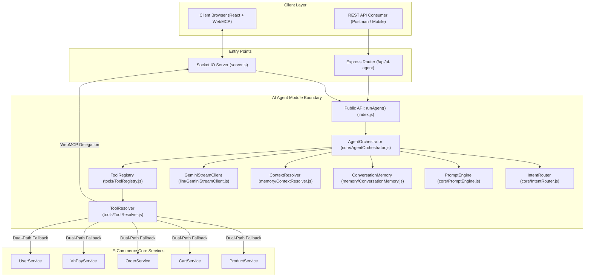

# Kiến Trúc AI Agent Module (Clean & Modular Architecture)

Tài liệu này mô tả toàn bộ kiến trúc độc lập của Module AI Agent sau khi refactor, tách rời hoàn toàn khỏi business logic trực tiếp của E-Commerce và tuân thủ nguyên tắc **Clean Architecture / Hexagonal Architecture (Ports and Adapters)**.

---

## 1. Tổng Quan Kiến Trúc & Ranh Giới (Boundary)

AI Agent được đóng gói độc lập trong thư mục `backend/modules/ai-agent/`. Hệ thống E-Commerce chính tương tác với AI Agent thông qua một **Public Boundary API duy nhất** (`backend/modules/ai-agent/index.js`), không truy cập trực tiếp vào các tệp cấu trúc nội bộ.

Ngược lại, AI Agent không được phép can thiệp trực tiếp vào Mongoose Models hoặc Database của E-Commerce; toàn bộ hành động thay đổi dữ liệu đều phải đi qua **Tầng Services** (`ProductService`, `CartService`, `OrderService`, `VnPayService`, `UserService`).

---

## 2. Các Phân Tầng Chức Năng Của Module

### 2.1. Tầng LLM (`backend/modules/ai-agent/llm/`)
* **Tệp:** `GeminiStreamClient.js`
* **Trách nhiệm:**
  - Thiết lập kết nối HTTP Streaming trực tiếp tới Google Gemini REST API (`gemini-2.0-flash`).
  - Hỗ trợ giải mã dòng byte nhận được bằng `string_decoder.StringDecoder('utf8')` an toàn, chống phân mảnh UTF-8 giữa các buffer chunk.
  - Phân tích cú pháp JSON Lines (SSE format) để trích xuất `candidates[0].content.parts` phục vụ phát sóng chữ thời gian thực (realtime streaming) và phát hiện lệnh gọi công cụ (`functionCalls`).

### 2.2. Tầng Bộ Nhớ & Ngữ Cảnh (`backend/modules/ai-agent/memory/`)
* **Tệp:** `ConversationMemory.js`
  - Đóng gói logic đọc/ghi lịch sử chat người dùng.
  - Quản lý phiên làm việc (`sessionId`) với Redis (thông qua `redisClient`). Nếu Redis gặp sự cố, tự động fallback sang lưu trữ in-memory an toàn.
  - Cắt tỉa (trim) lịch sử hội thoại tự động để duy trì cửa sổ ngữ cảnh (Context Window) tối ưu chi phí token.
* **Tệp:** `ContextResolver.js`
  - Chuẩn hóa từ lóng tiếng Việt (Teencode, Slang) thông qua từ điển `config/slangDictionary.json`.
  - Phân giải đại từ chỉ định ("nó", "con thứ 2", "cái này") dựa vào danh sách sản phẩm hiển thị ở lượt chat gần nhất (`referenceResolver`).

### 2.3. Tầng Điều Phối Trung Tâm (`backend/modules/ai-agent/core/`)
* **Tệp:** `AgentOrchestrator.js`
  - Trái tim của AI Agent điều hành vòng lặp suy luận (Agent Loop):
    1. Nhận yêu cầu $\rightarrow$ Phân giải đại từ & chuẩn hóa từ lóng.
    2. Nạp ngữ cảnh phiên từ `ConversationMemory`.
    3. Định tuyến ý định qua `IntentRouter` $\rightarrow$ Lọc danh sách công cụ cần thiết (tiết kiệm 60-70% token).
    4. Sinh System Prompt tương ứng qua `PromptEngine`.
    5. Gửi yêu cầu stream tới `GeminiStreamClient`.
    6. Nếu Gemini yêu cầu gọi Function Call $\rightarrow$ Chuyển quyền cho `ToolRegistry`.
    7. Nhận kết quả từ Tool $\rightarrow$ Gửi vòng lặp tiếp theo tới Gemini cho đến khi hoàn tất.
* **Tệp:** `IntentRouter.js`
  - Phân loại câu hỏi thành các domain: `PRODUCT`, `CART`, `ORDER`, `PAYMENT`, `PROFILE`, `GENERAL`.
  - Tính toán trọng số từ khóa và duy trì ngữ cảnh từ lượt chat trước (Context Retention).
* **Tệp:** `PromptEngine.js`
  - Đóng gói toàn bộ System Instructions modular theo từng domain.
  - Tự động gắn kèm khối điều hướng nút bấm hành động `[ACTIONS]{"buttons":[...]}[/ACTIONS]` vào cuối câu trả lời của Agent.

### 2.4. Tầng Trừu Tượng Hóa Công Cụ (`backend/modules/ai-agent/tools/`)
* **Tệp:** `AgentTool.js` — Hợp đồng cơ sở (Contract) cho toàn bộ 15 Tools.
* **Tệp:** `ToolResolver.js` — Bộ định tuyến Dual-Path.
* **Tệp:** `adapters/LocalServiceAdapter.js` — Thực thi server-side qua Services.
* **Tệp:** `adapters/WebMCPAdapter.js` — Ủy quyền thực thi client-side qua WebMCP.
* **Tệp:** `ToolRegistry.js` — Quản lý danh mục 15 Tool instances và schema JSON Schema declarations.
* **Thư mục:** `actions/` — Các adapter bọc trực tiếp các Services:
  - `productTools.js` $\rightarrow$ `ProductService`
  - `cartTools.js` $\rightarrow$ `CartService`
  - `orderTools.js` $\rightarrow$ `CartService.checkout` & `OrderService`
  - `paymentTools.js` $\rightarrow$ `VnPayService` & `OrderService`
  - `userTools.js` $\rightarrow$ `UserService`

---

## 3. Streaming & Quản Lý Trạng Thái Realtime

* **Socket.IO Event Stream:**
  - `client_send_message`: Client gửi tin nhắn, kèm `sessionId`, `token`, `hasWebMCP: true`.
  - `agent_response_chunk`: Server phát dòng chữ liên tục khi nhận từng chunk từ Gemini API.
  - `execute_webmcp_tool`: Server ủy quyền yêu cầu thực thi Tool về phía Trình duyệt.
  - `webmcp_tool_result_${executionId}`: Trình duyệt gửi trả kết quả thực thi về Server.
  - `agent_response_end`: Server phát thông báo hoàn tất, kèm metadata sản phẩm và nút bấm điều hướng.
