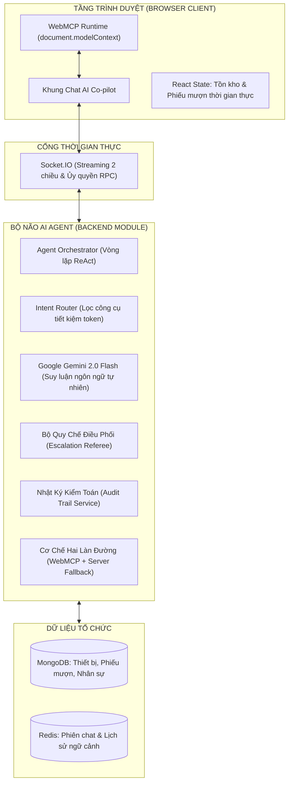

# ĐỀ XUẤT ĐỀ TÀI: HỆ THỐNG AI AGENT TỰ HÀNH ĐIỀU PHỐI & CẤP PHÁT THIẾT BỊ NỘI BỘ
> **Tên dự án:** EquipAgent AI (Autonomous Equipment Escalation Referee)  
> **Cuộc thi:** MLAI Hackathon 2026 · Mạng lưới AI khu vực phía Nam (HCMUT × HUTECH × VNG)  
> **Hạng mục:** Bảng 1 - OrganizationAI · **Đề bài A: The Escalation Referee**

---

## 1. THÔNG TIN CHUNG & TỔNG QUAN ĐỀ TÀI

* **Tên đề tài:** Hệ Thống AI Agent Tự Hành Điều Phối & Cấp Phát Thiết Bị Nội Bộ Đảm Bảo Trách Nhiệm Giải Trình.
* **Tên thương hiệu & Quốc tế:** **EquipAgent AI** (`Internal Equipment Provisioning & Autonomous Escalation Referee`).
* **Khẩu hiệu cốt lõi (Slogan):** *"Tự động hóa tác vụ thường quy — Minh bạch trách nhiệm giải trình — Dừng lại chính xác khi cần con người can thiệp."*
* **Đối tượng phục vụ:** Trường đại học (giảng viên, sinh viên, cán bộ quản lý phòng Lab), Doanh nghiệp công nghệ (nhân viên, IT Support, phòng Quản trị Hành chính).

---

## 2. BỐI CẢNH & THỰC TRẠNG NHỨC NHỐI (NỖI ĐAU THỰC TẾ)

### 2.1. Thực trạng tại các Tổ chức hiện nay
Trong bất kỳ trường đại học hoặc doanh nghiệp nào, nhu cầu mượn và cấp phát thiết bị công nghệ diễn ra hàng ngày, hàng giờ:
* Sinh viên/Giảng viên cần: *Cáp chuyển HDMI/Type-C, Mic trợ giảng, Bút trình chiếu, Bộ kit thí nghiệm, Máy chiếu.*
* Nhân viên công ty cần: *Màn hình mở rộng, Chuột/Bàn phím thay thế, Laptop dự phòng, Máy quay phim/Flycam làm sự kiện.*

### 2.2. Nghịch lý quản lý (The Management Dilemma)
Quy trình mượn trả truyền thống đang rơi vào một nghịch lý bế tắc:

```
                      ┌──────────────────────────────────────────────┐
                      │          NGHỊCH LÝ QUẢN LÝ THIẾT BỊ          │
                      └──────────────────────┬───────────────────────┘
                                             │
             ┌───────────────────────────────┴───────────────────────────────┐
             ▼                                                               ▼
   [PHƯƠNG ÁN 1: THẮT CHẶT]                                      [PHƯƠNG ÁN 2: BUÔNG LỎNG]
• Bắt làm phiếu giấy / tạo ticket Jira.                       • Cho nhân viên/sinh viên tự do lấy đồ.
• Chờ Trưởng phòng / Trưởng khoa ký duyệt.                    • Không cần thủ tục phiền hà.
• Chờ Thủ kho đi kiểm tra tủ đồ.                                             ▼
             ▼                                                ❌ HẬU QUẢ:
❌ HẬU QUẢ:                                                    • Mất mát tài sản hàng trăm triệu đồng.
• Mất 1 - 3 ngày chỉ để mượn sợi cáp 50k.                     • Không ai chịu trách nhiệm khi đồ hỏng.
• Đình trệ cuộc họp, trễ giờ thuyết trình.                     • Đùn đẩy, thất lạc thiết bị liên miên.
• Sếp và Thủ kho quá tải vì duyệt vặt.
```

👉 **Vấn đề cốt lõi:** Các tổ chức thiếu một **"Trọng tài thông minh (Referee)"** — một hệ thống đủ thông minh để **tự duyệt ngay lập tức các nhu cầu thường quy**, nhưng **tuyệt đối không được tự ý duyệt các tài sản lớn hoặc các tình huống bất thường** mà phải chuyển tiếp cho người có thẩm quyền.

---

## 3. MỤC TIÊU CỦA ĐỀ TÀI

1. **Rút ngắn thời gian mượn thiết bị:** Giảm thời gian từ lúc phát sinh nhu cầu đến khi nhận được thiết bị từ **2 ngày xuống còn 30 giây** đối với các thiết bị thường quy.
2. **Tự động hóa 80% tác vụ lặp lại:** Giải phóng đội ngũ Thủ kho và IT Helpdesk khỏi các công việc phê duyệt giấy tờ thủ công lặt vặt.
3. **Minh bạch trách nhiệm giải trình 100% (Accountability):** Mọi quyết định của AI đều có vết suy luận (Audit Trail), người quản trị có quyền tra cứu lý do, có thể dừng hoặc hoàn tác (Rollback) bất cứ lúc nào.
4. **Phân định ranh giới tự động hóa an toàn (Escalation):** Xác định chính xác 100% các trường hợp vượt thẩm quyền hoặc mờ thông tin để xin ý kiến con người, không bao giờ "đoán bừa".

---

## 4. Ý TƯỞNG CỐT LÕI & GIẢI PHÁP CÔNG NGHỆ

Hệ thống kết hợp bộ ba công nghệ tiên tiến tạo nên một **Tác tử tự hành thực thụ (Autonomous Web Agent)**:



### 4.1. Bộ não suy luận ReAct (Reasoning + Action)
* Sử dụng mô hình **Google Gemini 2.0 Flash** với khả năng đọc hiểu tiếng Việt xuất sắc.
* Tự động nhận diện tiếng Việt viết tắt (*"đt"*, *"prm"*), sửa lỗi gõ Telex vô thức (*"thêm nói"* $\rightarrow$ *"thêm nó"*), và giải quyết đại từ chỉ định (*"mượn con thứ 2"*, *"lấy cái này"*).

### 4.2. Đôi tay hành động WebMCP (Web Model Context Protocol)
* Thay vì chỉ trả về câu chữ lý thuyết, AI được trang bị WebMCP chạy trực tiếp trên trình duyệt của người dùng (`document.modelContext`).
* **Đồng bộ giao diện tức thì (Zero-Latency UI Sync):** Khi AI duyệt phiếu mượn, biểu tượng danh sách thiết bị trên màn hình nhảy số ngay lập tức, số lượng tồn kho tự động trừ đi trước mắt người dùng mà không cần F5 trang web.
* **Bảo mật Zero-Trust:** Trình duyệt tự đính kèm JWT của người mượn, Server AI không cần lưu giữ mật khẩu hay token nhạy cảm.

### 4.3. Kiến trúc Hai làn đường (Dual-Path Resilience)
* **Làn 1 (WebMCP):** Ưu tiên ủy quyền cho trình duyệt thực thi và hiển thị.
* **Làn 2 (Server Fallback):** Nếu máy khách mất mạng, lag hoặc đóng tab quá 15 giây, Server tự động kích hoạt Service nội bộ để bọc lót, đảm bảo quy trình không bao giờ bị đứt gãy.

---

## 5. CƠ CHẾ PHÂN ĐỊNH QUYỀN HẠN & 3 NHÓM CHUYỂN TIẾP (ESCALATION RULES)

Đúng theo yêu cầu trọng tâm của **Đề bài A**, hệ thống phân loại mọi yêu cầu mượn thiết bị thành 3 nhóm rõ rệt:

```
                                [YÊU CẦU MƯỢN THIẾT BỊ]
                                           │
                        ┌──────────────────┴──────────────────┐
                        ▼                                     ▼
             [KIỂM TRA QUY ĐỊNH KHO]                [GẮN CỜ NGHI VẤN / RỦI RO]
                        │                                     │
           ┌────────────┴────────────┐             ┌──────────┴──────────┐
           ▼                         ▼             ▼                     ▼
     [HỢP LỆ & PHỔ THÔNG]     [THIẾU THÔNG TIN]  [SAI QUY ĐỊNH]    [TÀI SẢN LỚN]
           │                         │             │                     │
           ▼                         ▼             ▼                     ▼
     ✅ NHÓM 0:                 ⚠️ NHÓM 1:       🚨 NHÓM 2:        🔒 NHÓM 3:
   TỰ ĐỘNG DUYỆT 100%         UNCERTAIN_INFO   OUT_OF_POLICY     HIGH_AUTHORITY
  • Cáp HDMI, Mic, Bút trình   • Thiếu giờ trả  • Mượn đi chơi    • Máy quay 4K, Flycam
  • Mượn < 48 giờ              • Thiếu phòng họp • Mượn quá SL     • Mượn dài ngày (> 7d)
  • Tồn kho còn sẵn            • Ảnh biên nhận mờ                      │
           │                         │             │                   │
           ▼                         ▼             ▼                   ▼
    [Xuất mã QR nhận đồ]      [Hỏi lại Người mượn] ───► [Chuyển tiếp Quản lý Duyệt]
```

### Bảng Đặc Tả Chi Tiết 3 Nhóm Chuyển Tiếp:

| Nhóm phân loại | Mã phân loại | Tình huống thực tế | Hành động của Hệ thống | Mẫu câu hỏi chuyển tiếp |
| :--- | :---: | :--- | :--- | :--- |
| **Thường quy** | `ROUTINE_AUTO` | Mượn 2 mic không dây, 1 cáp HDMI trong 4 giờ. | **Tự động 100%:** Trừ kho, tạo phiếu mượn, cấp mã QR nhận đồ tại tủ. | *(Không làm phiền con người)* |
| **Nhóm 1: Chưa rõ thông tin** | `UNCERTAIN_INFO` | Khách nhắn *"Cho mượn máy chiếu Sony"* nhưng không nói dùng ở đâu, mấy giờ trả. | **Dừng lại hỏi người mượn:** Tuyệt đối không tự đoán mò giờ trả. | *"Kho đang sẵn máy chiếu Sony, bạn vui lòng cho biết bạn sử dụng tại phòng nào và dự kiến trả trước mấy giờ chiều nay?"* |
| **Nhóm 2: Ngoài quy định** | `OUT_OF_POLICY` | Mượn 10 bộ máy ảnh để đi du lịch cá nhân, hoặc tài khoản đang nợ đồ quá hạn. | **Chặn lại & Báo cáo:** Nêu rõ điều khoản vi phạm, hỏi xác nhận ngoại lệ. | *"Yêu cầu mượn 10 máy ảnh không thuộc mục đích phục vụ sự kiện của trường. Bạn có văn bản phê duyệt ngoại lệ của Trưởng khoa không?"* |
| **Nhóm 3: Vượt thẩm quyền** | `HIGH_AUTHORITY` | Mượn Máy quay Sony A7IV (50 triệu) hoặc mượn thiết bị dài hạn trên 10 ngày. | **Chuyển tiếp cấp cao:** Đóng gói hồ sơ, gửi thông báo cho Quản lý kèm nút duyệt 1 chạm. | *"Sinh viên Nguyễn Văn A đề xuất mượn Máy quay 4K Sony A7IV trong 10 ngày để quay phim tốt nghiệp. Thầy/Cô có phê duyệt yêu cầu này không?"* |

---

## 6. TRÁCH NHIỆM GIẢI TRÌNH (HUMAN-IN-THE-LOOP & AUDIT TRAIL)

Hệ thống được thiết kế theo tiêu chuẩn an toàn cấp doanh nghiệp, đảm bảo con người luôn nắm quyền kiểm soát cao nhất:

### 6.1. Bảng Nhật ký Kiểm toán (Audit Trail)
Mọi hành động của AI (tự duyệt, trừ kho, từ chối, chuyển tiếp) đều được ghi nhận bất biến (immutable log):
* **Thời điểm thực thi (Timestamp):** Chính xác đến từng mili-giây.
* **Tác nhân (Actor):** AI Agent hay Người dùng nào yêu cầu.
* **Dữ liệu đầu vào (Input Data):** Câu chat nguyên văn của người mượn.
* **Chuỗi suy luận (Reasoning Trace):** Tại sao AI lại đưa ra quyết định đó (căn cứ theo điều khoản nào của quy chế kho).

### 6.2. Quyền Can thiệp: Dừng & Hoàn tác 1 chạm (Rollback Button)
* Khi Thủ kho hoặc Quản lý phát hiện một trường hợp tự duyệt có dấu hiệu bất thường:
* Chỉ cần bấm nút **`[Hoàn tác hành động này (Rollback)]`** trong bảng Audit Trail:
  * Hệ thống lập tức thu hồi mã nhận đồ.
  * Tồn kho thiết bị tự động được cộng trả lại (`Stock + 1`).
  * Gửi tin nhắn thông báo hủy phiếu mượn cho người yêu cầu.

### 6.3. Giải thích cho người không chuyên (Explainability)
* Bên cạnh mỗi câu trả lời của AI có nút: **`[❓ Tại sao hệ thống quyết định như vậy?]`**.
* Nhấp vào sẽ hiển thị lời giải thích bằng ngôn ngữ bình dân:  
  *Ví dụ:* *"Theo Quy chế Thiết bị Điều 4: Máy quay phim là tài sản loại A (giá trị > 20 triệu) và thời gian mượn tối đa chỉ là 3 ngày. Do bạn yêu cầu mượn 10 ngày, hệ thống bắt buộc phải chuyển tiếp xin chữ ký của Trưởng bộ phận."*

---

## 7. ĐO LƯỜNG TÁC ĐỘNG & BẰNG CHỨNG THỰC TẾ (TRƯỚC VÀ SAU)

### 7.1. Bảng Đối Chiếu Số Liệu Định Lượng (Before vs After)

| Chỉ số đo lường | Quy trình truyền thống (Giấy tờ / Ticket) | Quy trình với EquipReferee | Mức độ cải thiện |
| :--- | :---: | :---: | :---: |
| **Thời gian mượn đồ thường quy** | 4 – 24 giờ (chờ ký duyệt) | **15 – 30 giây** | **Nhanh hơn ~98%** |
| **Công sức của Thủ kho / IT Support** | Mất 2 – 3 giờ/ngày để xử lý giấy tờ | Mất ~15 phút/ngày để xem xét các ca ngoại lệ | **Giảm 85% khối lượng việc vặt** |
| **Tỷ lệ thất lạc / Quên trả đồ** | ~12% (do sổ sách giấy thất lạc) | **< 1%** (có thông báo nhắc lịch tự động) | **Gần như triệt tiêu thất thoát** |
| **Độ chính xác chuyển tiếp rủi ro** | Dễ nể nang cho mượn bừa bãi | **100%** tài sản lớn bắt buộc qua sếp duyệt | **An toàn tài sản tuyệt đối** |

### 7.2. Nhận diện Trung thực Bất cập Phát sinh & Biện pháp Xử lý
Theo đúng tiêu chí chấm điểm khách quan của Ban giám khảo (Slide 5):
* **Bất cập phát sinh 1 (Thói quen người dùng):** Người dùng ban đầu có thói quen chat câu quá ngắn gọn cộc lốc (*"lấy máy"*), AI phải hỏi lại nhiều lần gây cảm giác phiền phức.  
  👉 *Khắc phục:* Bổ sung hàng nút gợi ý mẫu câu nhanh (**Quick Prompts**) trên giao diện chat.
* **Bất cập phát sinh 2 (Phụ thuộc vào mạng):** Nếu mạng internet trường học bị mất, người dùng không chat được với AI.  
  👉 *Khắc phục:* Kiến trúc Dual-Path cho phép lưu hàng đợi offline và đồng bộ ngay khi có mạng trở lại.

---

## 8. KẾ HOẠCH TRIỂN KHAI & KỊCH BẢN CHẤM THI 90 GIÂY

### 8.1. Nút Bấm Thần Tốc "Verify Harness 90s" (Ăn trọn 12 Điểm)
Trên thanh công cụ của trang web có sẵn nút bấm nổi bật: **`[⚡ Chạy Kiểm Thử 90 Giây]`**.  
Khi Giám khảo bấm vào, hệ thống tự động bắn tuần tự 5 test cases kinh điển trong vòng 3 giây:
1. *Case 1 (Thường quy):* Mượn 2 mic không dây 4h $\rightarrow$ `PASS (AUTO_APPROVED)`.
2. *Case 2 (Thường quy):* Mượn cáp HDMI chiều nay $\rightarrow$ `PASS (AUTO_APPROVED)`.
3. *Case 3 (Thường quy):* Lấy 1 ram giấy in A4 $\rightarrow$ `PASS (AUTO_APPROVED)`.
4. *Case 4 (Mờ thông tin):* Mượn máy chiếu không ghi giờ $\rightarrow$ `PASS (ASK_CLARIFICATION)`.
5. *Case 5 (Vượt thẩm quyền):* Mượn Máy quay 4K 10 ngày $\rightarrow$ `PASS (ESCALATE_TO_MANAGER)`.

### 8.2. Công Tắc Đổi Vai Trò 1 Chạm (1-Click Role Switcher)
Cho phép Giám khảo trải nghiệm cả 2 góc nhìn trong vòng 60 giây mà không cần đăng xuất:
* **Góc nhìn Người mượn:** Chat mượn đồ, nhận mã QR xuất kho.
* **Góc nhìn Quản lý/Thủ kho:** Nhận thông báo ca vượt thẩm quyền, bấm `[Phê duyệt]` hoặc mở bảng Audit Trail để bấm `[Hoàn tác]`.

---

## 9. TỔNG KẾT
Đề tài **EquipAgent AI** là sự kết hợp hoàn hảo giữa:
* **Một bài toán đời thực cấp bách:** Giải quyết trực diện nỗi đau của trường học và doanh nghiệp.
* **Một nền tảng công nghệ thời thượng:** AI Agent ReAct + WebMCP + Dual-Path Fallback.
* **Khớp 100% barem chấm thi của MLAI Hackathon 2026:** Đáp ứng trọn vẹn từng tiêu chí từ Vận hành, Người dùng thật, Human-in-the-loop đến bài test Escalation 90 giây.
