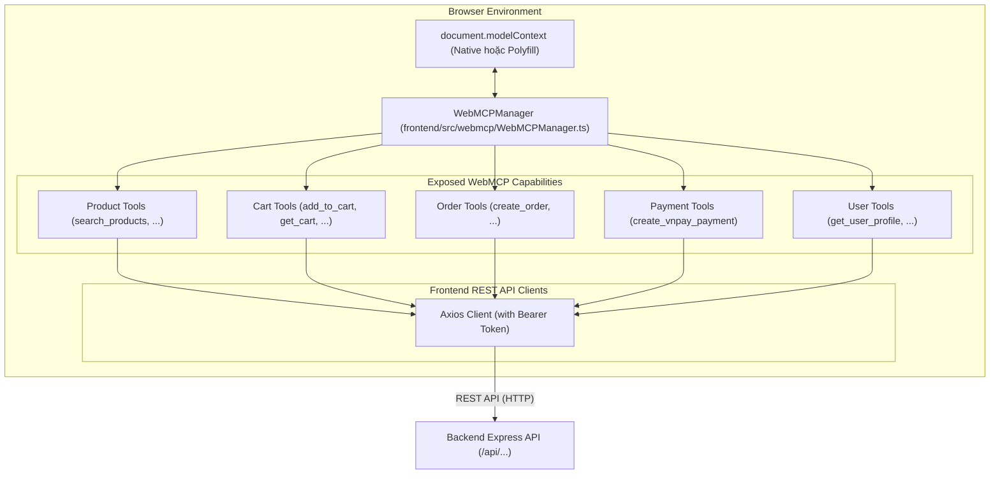
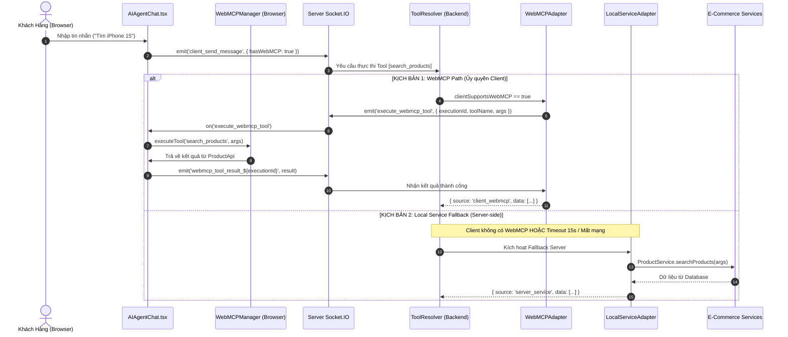

# Kiến Trúc WebMCP (Web Model Context Protocol) & Cơ Chế Dual-Path

Tài liệu này cung cấp đặc tả kỹ thuật chuyên sâu về việc tích hợp chuẩn **WebMCP (Web Model Context Protocol)** vào website E-Commerce, biến ứng dụng web thành một WebMCP Provider/Server trên trình duyệt của người dùng, đồng thời đảm bảo cơ chế **Dual-Path Execution** an toàn tuyệt đối.

---

## 1. WebMCP Là Gì?

**WebMCP (Web Model Context Protocol)** là tiêu chuẩn mở mở rộng từ Model Context Protocol (MCP) của Anthropic, được thiết kế đặc thù cho môi trường **Web/Trình duyệt (Browser)** (tương thích với định hướng chuẩn hóa của W3C và Chrome Early Preview).

Trong khi MCP truyền thống hoạt động qua `stdio` hoặc Server-Sent Events (SSE) trên môi trường máy tính để bàn (Desktop OS):
* **WebMCP** cho phép các trang web **expose trực tiếp các Capabilities (Tools & Resources)** của chính nó vào đối tượng toàn cục `document.modelContext` trên trình duyệt.
* Các tác nhân AI (AI Agents, Browser Extensions, hoặc Server-side Orchestrator) có thể khám phá (Discover) và kích hoạt thực thi các công cụ này thông qua ngữ cảnh phiên đăng nhập của người dùng.

---

## 2. Mô Hình Runtime & WebMCP Polyfill trên Frontend

Để đảm bảo tương thích 100% trên tất cả các trình duyệt hiện nay (kể cả khi trình duyệt chưa bật cờ thử nghiệm Chrome WebMCP), dự án triển khai một **WebMCPManager & Polyfill Runtime** tại `frontend/src/webmcp/`:



### 2.1. Chuẩn Khai Báo Tool (Contract)
Mỗi WebMCP Tool tuân thủ interface chuẩn:
```typescript
interface WebMCPToolDefinition {
  name: string;
  description: string;
  inputSchema: {
    type: "object";
    properties: Record<string, any>;
    required?: string[];
  };
  execute: (input: Record<string, any>) => Promise<any>;
}
```

### 2.2. Cơ Chế Discovery (Khám Phá Tool trên Console)
Bất kỳ tác nhân nào truy cập vào trang web đều có thể truy xuất danh sách Capabilities:
```javascript
// Chạy trực tiếp trên Console trình duyệt:
const tools = document.modelContext.getTools();
console.log(tools.map(t => t.name));
// ['search_products', 'get_product_detail', 'get_categories', 
//  'add_to_cart', 'get_cart', 'remove_from_cart', 'update_cart', 'clear_cart',
//  'create_order', 'get_order_detail', 'get_user_orders', 'cancel_order',
//  'create_vnpay_payment', 'get_user_profile', 'update_user_profile']
```

---

## 3. Kiến Trúc Dual-Path Execution (Ủy Quyền vs Fallback)

Hệ thống triển khai mô hình **Dual-Path** nhằm đảm bảo AI Agent luôn thực hiện thành công yêu cầu của khách hàng trong mọi kịch bản môi trường:



### Các Kịch Bản Fallback Tự Động:
1. **Headless / REST Endpoint:** Các yêu cầu gửi qua REST API `/api/ai-agent` không có WebSocket sẽ tự động 100% chạy qua `LocalServiceAdapter`.
2. **WebMCP Execution Error:** Nếu trình duyệt của client gặp lỗi JavaScript hoặc mạng client bị đứt, `WebMCPAdapter` bắt ngoại lệ và kích hoạt `LocalServiceAdapter`.
3. **WebMCP Timeout (15s):** Nếu trình duyệt không phản hồi sau 15 giây (ví dụ: người dùng đóng tab, máy bị treo), server tự động hủy lắng nghe và fallback sang `LocalServiceAdapter`.

---

## 4. Ma Trận Bảo Mật & Xác Thực (Security Architecture)

1. **Ủy quyền JWT Token Tự Động:**
   - WebMCP tools trên trình duyệt tận dụng trực tiếp phiên đăng nhập của người dùng qua Axios Interceptor hoặc `localStorage.getItem("token")`.
   - AI Agent trên server không cần phải lưu trữ thông tin nhạy cảm của khách hàng; trình duyệt thực hiện request với chính quyền hạn của user.
2. **CORS & Origin Verification:**
   - Socket.IO và Express API chỉ chấp nhận kết nối từ đúng origin được cấu hình tại `FRONTEND_URL` (`http://localhost:5173`).
3. **Schema Validation:**
   - Mọi tham số đầu vào trước khi truyền vào tool đều được kiểm duyệt cấu trúc kiểu dữ liệu theo JSON Schema.
4. **Không Đặt Business Logic tại WebMCP Tools:**
   - Các tool trên trình duyệt đóng vai trò là **API Consumer**. Mọi logic trừ tiền, trừ tồn kho, xác thực đơn hàng đều nằm tại Server Services (`OrderService`, `CartService`).

---

## 5. Bảng So Sánh Toàn Diện: WebMCP vs MCP vs Function Calling

| Tiêu chí | Function Calling Truyền Thống | MCP Chuẩn (Desktop/Stdio) | WebMCP (Được triển khai trong dự án) |
| :--- | :--- | :--- | :--- |
| **Môi trường thực thi** | Server-side độc quyền | Desktop OS (qua Stdio / SSE Localhost) | **Trình duyệt khách hàng (Browser Runtime)** |
| **Quyền hạn & Ngữ cảnh** | Backend Service Account | Process User Permissions | **Phiên duyệt web của chính người dùng (JWT/Cookies)** |
| **Khả năng Fallback** | Không có (Lỗi là dừng) | Phụ thuộc MCP Host | **Dual-Path: Tự động fallback sang Server Service** |
| **Discovery** | Hardcoded trong server prompt | JSON-RPC qua stdio | **`document.modelContext.getTools()` trên Window/DOM** |
| **Độ trễ (Latency)** | Nhanh nội bộ server | Trung bình (IPC stdio) | **Nhanh (Realtime Socket.IO Delegation)** |
| **Headless Support** | Tốt | Kém trên môi trường web | **Hoàn hảo nhờ Dual-Path ToolResolver** |
