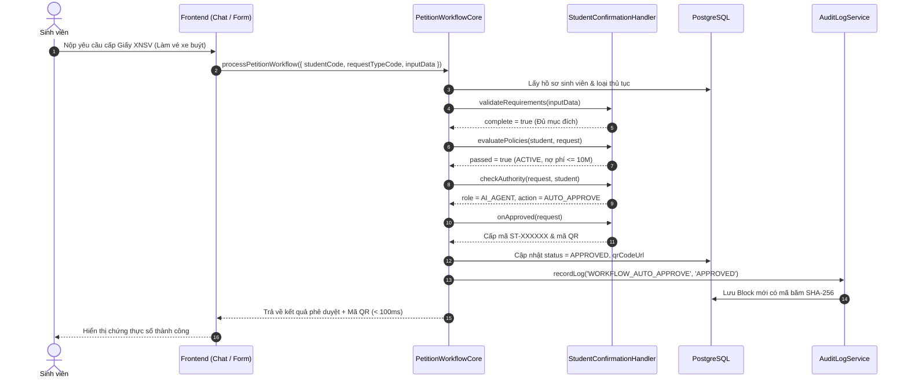
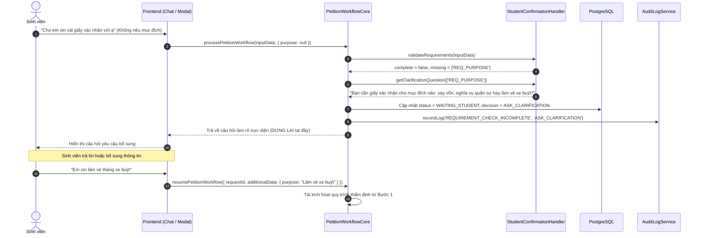
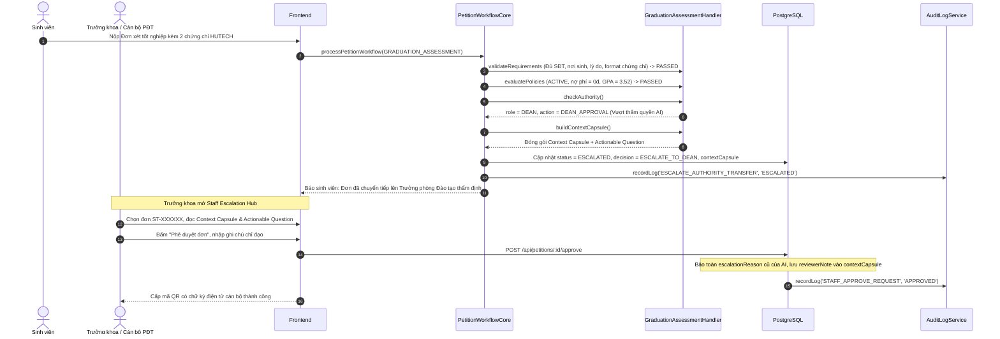
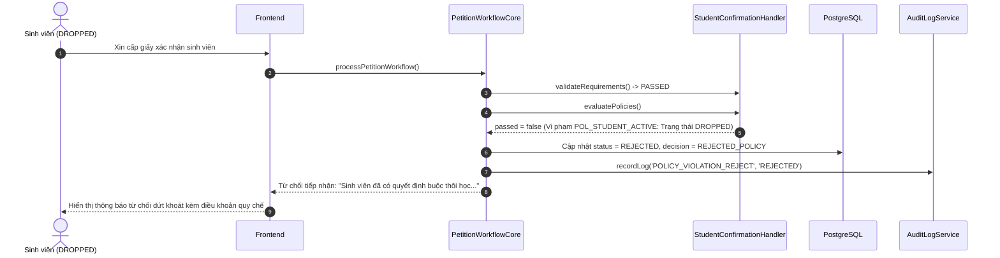
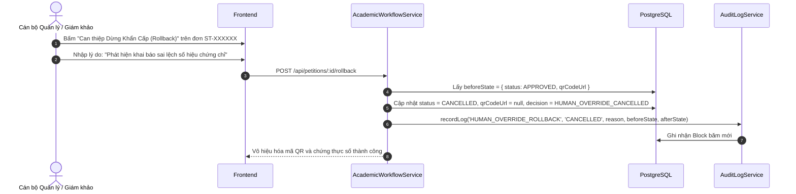
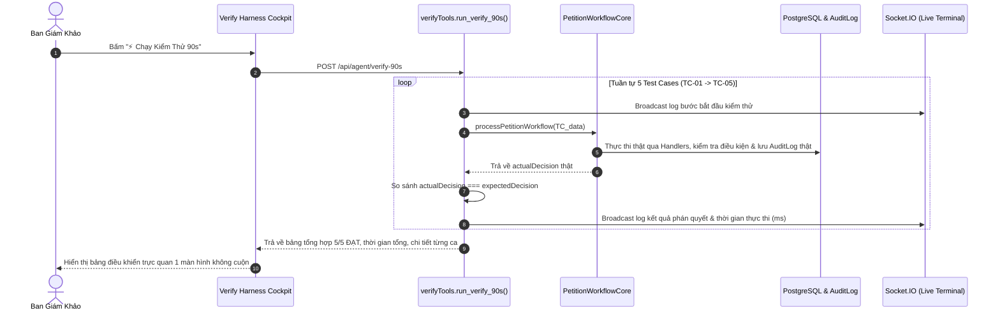
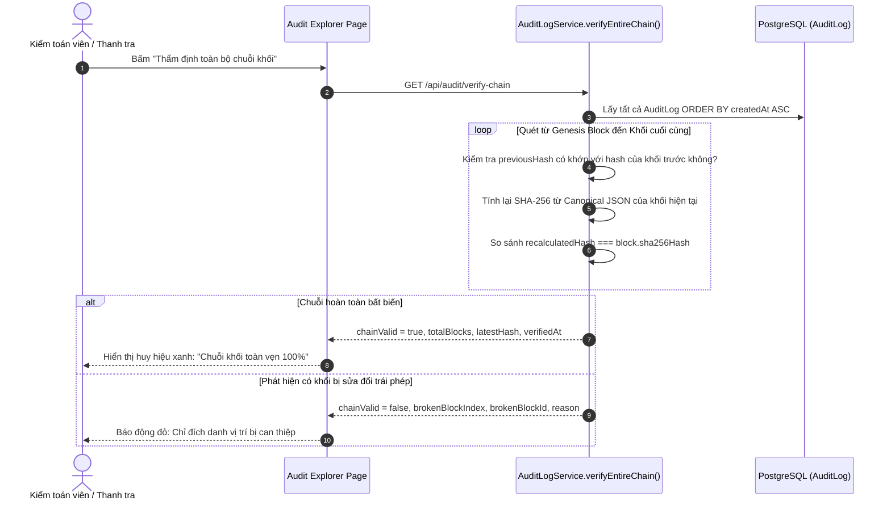

# 03. CÁC QUY TRÌNH NGHIỆP VỤ (BUSINESS WORKFLOWS)
**Dự án:** EduRef AI — The Academic Escalation Referee  
**Đối soát:** Mã nguồn thực tế tại `PetitionWorkflowCore.js`, `AcademicWorkflowService.js`, `verifyTools.js`

---

## 1. FLOW 1: ROUTINE AUTO-APPROVAL (THƯỜNG QUY TỰ ĐỘNG DUYỆT)

Áp dụng cho các thủ tục thường quy nằm trong thẩm quyền tự chủ của AI (ví dụ: Giấy xác nhận sinh viên hợp lệ).

---

## 2. FLOW 2: MISSING INFORMATION CLARIFICATION (CHỦ ĐỘNG LÀM RÕ DỮ KIỆN)

Áp dụng khi sinh viên đưa ra yêu cầu chưa đầy đủ dữ kiện bắt buộc.

---

## 3. FLOW 3: HIGH-AUTHORITY ESCALATION & STAFF HITL (VƯỢT THẨM QUYỀN & CÁN BỘ DUYỆT)

Áp dụng cho các thủ tục vượt thẩm quyền tự quyền của AI (Đơn xét tốt nghiệp, Hoãn thi, Cứu xét).

---

## 4. FLOW 4: HARD POLICY REJECTION (TỪ CHỐI DỨT KHOÁT DO SAI QUY CHẾ)

Áp dụng khi sinh viên vi phạm các quy chế đào tạo cứng (Thôi học, Nợ phí quá hạn).

---

## 5. FLOW 5: HUMAN OVERRIDE & REVOCATION (CAN THIỆP DỪNG & THU HỒI CHỨNG THỰC)

Áp dụng khi phát hiện sai sót, khiếu nại hoặc gian lận sau khi đơn đã được cấp mã QR.

---

## 6. FLOW 6: VERIFY HARNESS 90S (BỘ CHẠY KIỂM THỬ TỰ HÀNH)

Áp dụng cho Ban Giám Khảo kiểm chứng năng lực Bounded Autonomy của hệ thống trong 90 giây.

---

## 7. FLOW 7: CRYPTOGRAPHIC AUDIT VERIFICATION (THẨM ĐỊNH CHUỖI KHỐI TOÀN VẸN)

Áp dụng khi thanh tra đào tạo hoặc kiểm toán viên kiểm tra tính bất biến của hồ sơ.

