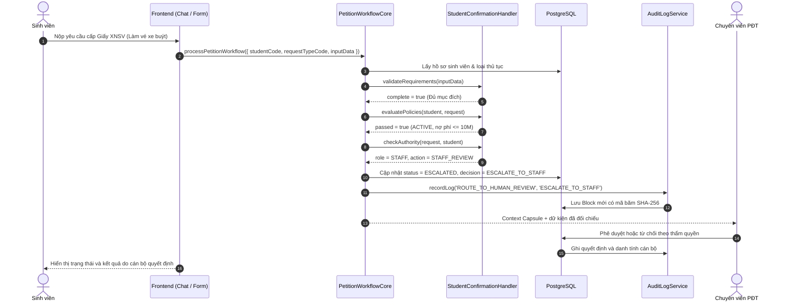
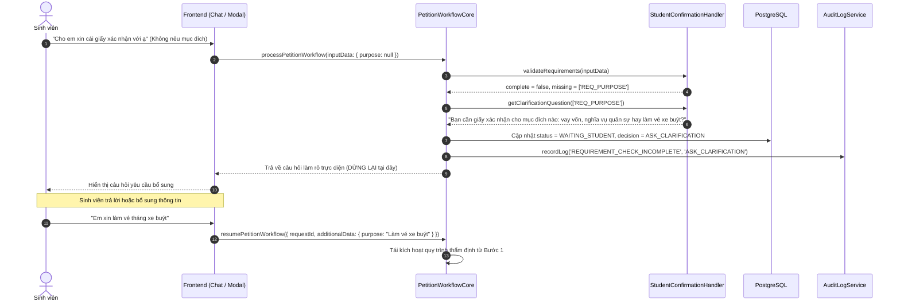
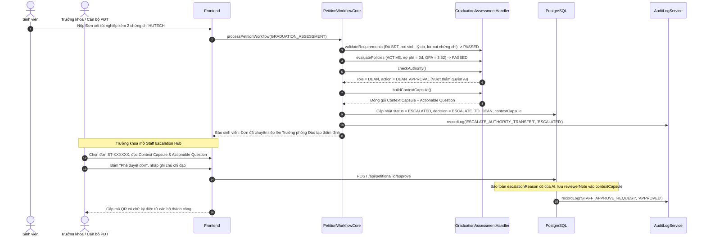
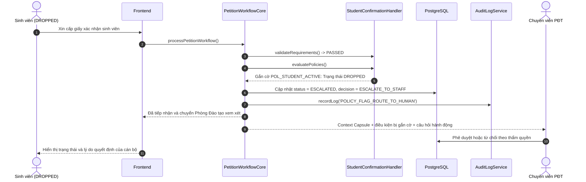
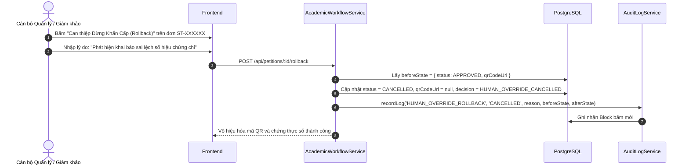
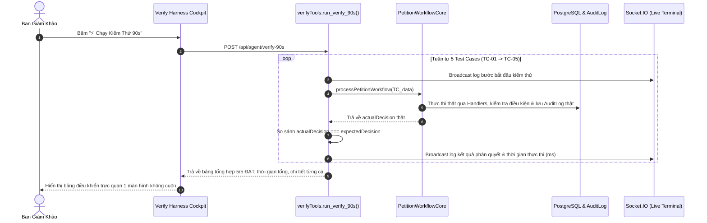
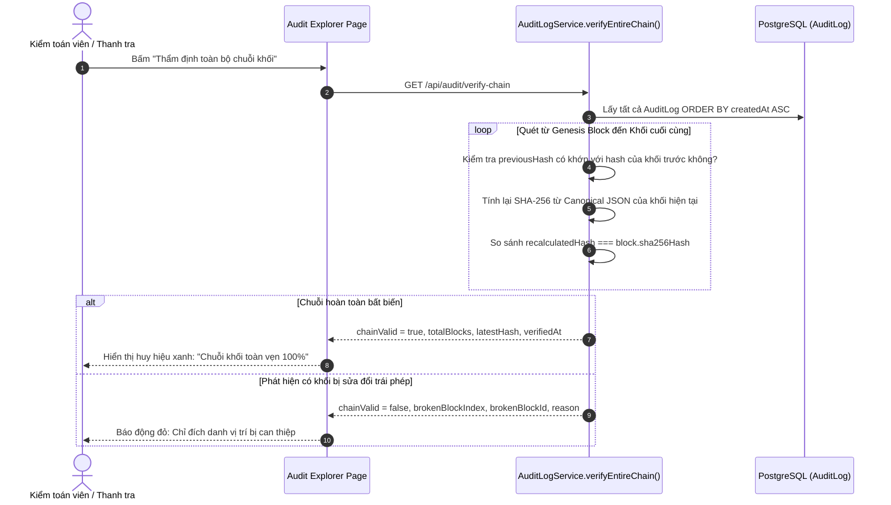

# 03. CÁC QUY TRÌNH NGHIỆP VỤ (BUSINESS WORKFLOWS)
**Dự án:** EduRef AI — The Academic Escalation Referee  
**Đối soát:** Mã nguồn thực tế tại `PetitionWorkflowCore.js`, `AcademicWorkflowService.js`, `verifyTools.js`

---

## Luồng tiếp nhận hiện hành cho sinh viên (Sprint 2)

`StudentIntakeService` xử lý hội thoại của vai trò STUDENT, tách khỏi agent dành cho cán bộ. Chat chỉ trả lời câu hỏi, hỏi bổ sung khi mục đích thiếu/mơ hồ hoặc tạo `intakeDraft`; không ghi `StudentRequest` vào database. Bản nháp gồm thông tin sinh viên từ phiên đã xác thực, mục đích, nơi tiếp nhận, ghi chú và Phòng Đào tạo là nơi nhận. Sinh viên xem/sửa rồi bấm **Gửi hồ sơ**; khi đó frontend mới gọi `POST /api/petitions`. Core chuyển hồ sơ đủ thông tin đến hàng đợi cán bộ; AI không tự phê duyệt hoặc từ chối.

Các sơ đồ Flow 1–2 bên dưới mô tả pipeline `PetitionWorkflowCore` sau khi đã nộp hoặc các workflow legacy; không phải thao tác ghi database ngay khi sinh viên gửi tin nhắn chat. Với `STUDENT_CONFIRMATION`, API nộp hồ sơ hiện trả lỗi 400 nếu thiếu mục đích, thay vì tạo hồ sơ `WAITING_STUDENT` từ chat.

---

## 1. FLOW 1: ROUTINE HUMAN REVIEW (HỒ SƠ THƯỜNG QUY QUA CÁN BỘ DUYỆT)

Áp dụng cho thủ tục thường quy như Giấy xác nhận sinh viên. AI chuẩn bị và định tuyến; Chuyên viên Phòng Đào tạo quyết định.

```mermaid
sequenceDiagram
    autonumber
    actor SinhVien as Sinh viên
    participant Frontend as Frontend (Chat / Form)
    participant Core as PetitionWorkflowCore
    participant Handler as StudentConfirmationHandler
    participant DB as PostgreSQL
    participant Audit as AuditLogService
    actor CanBo as Chuyên viên PĐT

    SinhVien->>Frontend: Nộp yêu cầu cấp Giấy XNSV (Làm vé xe buýt)
    Frontend->>Core: processPetitionWorkflow({ studentCode, requestTypeCode, inputData })
    Core->>DB: Lấy hồ sơ sinh viên & loại thủ tục
    Core->>Handler: validateRequirements(inputData)
    Handler-->>Core: complete = true (Đủ mục đích)
    Core->>Handler: evaluatePolicies(student, request)
    Handler-->>Core: passed = true (ACTIVE, nợ phí <= 10M)
    Core->>Handler: checkAuthority(request, student)
    Handler-->>Core: role = STAFF, action = STAFF_REVIEW
    Core->>DB: Cập nhật status = ESCALATED, decision = ESCALATE_TO_STAFF
    Core->>Audit: recordLog('ROUTE_TO_HUMAN_REVIEW', 'ESCALATE_TO_STAFF')
    Audit->>DB: Lưu Block mới có mã băm SHA-256
    Core-->>CanBo: Context Capsule + dữ kiện đã đối chiếu
    CanBo->>DB: Phê duyệt hoặc từ chối theo thẩm quyền
    DB->>Audit: Ghi quyết định và danh tính cán bộ
    Frontend-->>SinhVien: Hiển thị trạng thái và kết quả do cán bộ quyết định
```

---

## 2. FLOW 2: MISSING INFORMATION CLARIFICATION (CHỦ ĐỘNG LÀM RÕ DỮ KIỆN)

Áp dụng khi sinh viên đưa ra yêu cầu chưa đầy đủ dữ kiện bắt buộc.

```mermaid
sequenceDiagram
    autonumber
    actor SinhVien as Sinh viên
    participant Frontend as Frontend (Chat / Modal)
    participant Core as PetitionWorkflowCore
    participant Handler as StudentConfirmationHandler
    participant DB as PostgreSQL
    participant Audit as AuditLogService

    SinhVien->>Frontend: "Cho em xin cái giấy xác nhận với ạ" (Không nêu mục đích)
    Frontend->>Core: processPetitionWorkflow(inputData: { purpose: null })
    Core->>Handler: validateRequirements(inputData)
    Handler-->>Core: complete = false, missing = ['REQ_PURPOSE']
    Core->>Handler: getClarificationQuestion(['REQ_PURPOSE'])
    Handler-->>Core: "Bạn cần giấy xác nhận cho mục đích nào: vay vốn, nghĩa vụ quân sự hay làm vé xe buýt?"
    Core->>DB: Cập nhật status = WAITING_STUDENT, decision = ASK_CLARIFICATION
    Core->>Audit: recordLog('REQUIREMENT_CHECK_INCOMPLETE', 'ASK_CLARIFICATION')
    Core-->>Frontend: Trả về câu hỏi làm rõ trực diện (DỪNG LẠI tại đây)
    Frontend-->>SinhVien: Hiển thị câu hỏi yêu cầu bổ sung
    Note over SinhVien,Frontend: Sinh viên trả lời hoặc bổ sung thông tin
    SinhVien->>Frontend: "Em xin làm vé tháng xe buýt"
    Frontend->>Core: resumePetitionWorkflow({ requestId, additionalData: { purpose: "Làm vé xe buýt" } })
    Core->>Core: Tái kích hoạt quy trình thẩm định từ Bước 1
```

---

## 3. FLOW 3: HIGH-AUTHORITY ESCALATION & STAFF HITL (VƯỢT THẨM QUYỀN & CÁN BỘ DUYỆT)

Áp dụng cho các thủ tục vượt thẩm quyền tự quyền của AI (Đơn xét tốt nghiệp, Hoãn thi, Cứu xét).

```mermaid
sequenceDiagram
    autonumber
    actor SinhVien as Sinh viên
    actor CanBo as Trưởng khoa / Cán bộ PĐT
    participant Frontend as Frontend
    participant Core as PetitionWorkflowCore
    participant Handler as GraduationAssessmentHandler
    participant DB as PostgreSQL
    participant Audit as AuditLogService

    SinhVien->>Frontend: Nộp Đơn xét tốt nghiệp kèm 2 chứng chỉ HUTECH
    Frontend->>Core: processPetitionWorkflow(GRADUATION_ASSESSMENT)
    Core->>Handler: validateRequirements (Đủ SĐT, nơi sinh, lý do, format chứng chỉ) -> PASSED
    Core->>Handler: evaluatePolicies (ACTIVE, nợ phí = 0đ, GPA = 3.52) -> PASSED
    Core->>Handler: checkAuthority()
    Handler-->>Core: role = DEAN, action = DEAN_APPROVAL (Vượt thẩm quyền AI)
    Core->>Handler: buildContextCapsule()
    Handler-->>Core: Đóng gói Context Capsule + Actionable Question
    Core->>DB: Cập nhật status = ESCALATED, decision = ESCALATE_TO_DEAN, contextCapsule
    Core->>Audit: recordLog('ESCALATE_AUTHORITY_TRANSFER', 'ESCALATED')
    Core-->>Frontend: Báo sinh viên: Đơn đã chuyển tiếp lên Trưởng phòng Đào tạo thẩm định
    
    Note over CanBo,Frontend: Trưởng khoa mở Staff Escalation Hub
    CanBo->>Frontend: Chọn đơn ST-XXXXXX, đọc Context Capsule & Actionable Question
    CanBo->>Frontend: Bấm "Phê duyệt đơn", nhập ghi chú chỉ đạo
    Frontend->>DB: POST /api/petitions/:id/approve
    Note over DB: Bảo toàn escalationReason cũ của AI, lưu reviewerNote vào contextCapsule
    DB->>Audit: recordLog('STAFF_APPROVE_REQUEST', 'APPROVED')
    Frontend-->>CanBo: Cấp mã QR có chữ ký điện tử cán bộ thành công
```

---

## 4. FLOW 4: POLICY FLAG & HUMAN DECISION (GẮN CỜ VÀ CHUYỂN NGƯỜI CÓ THẨM QUYỀN)

Áp dụng khi AI phát hiện điều kiện cần cán bộ xác nhận như trạng thái thôi học hoặc nợ phí quá ngưỡng. AI không tự từ chối hồ sơ.

```mermaid
sequenceDiagram
    autonumber
    actor SinhVien as Sinh viên (DROPPED)
    participant Frontend as Frontend
    participant Core as PetitionWorkflowCore
    participant Handler as StudentConfirmationHandler
    participant DB as PostgreSQL
    participant Audit as AuditLogService
    actor CanBo as Chuyên viên PĐT

    SinhVien->>Frontend: Xin cấp giấy xác nhận sinh viên
    Frontend->>Core: processPetitionWorkflow()
    Core->>Handler: validateRequirements() -> PASSED
    Core->>Handler: evaluatePolicies()
    Handler-->>Core: Gắn cờ POL_STUDENT_ACTIVE: Trạng thái DROPPED
    Core->>DB: Cập nhật status = ESCALATED, decision = ESCALATE_TO_STAFF
    Core->>Audit: recordLog('POLICY_FLAG_ROUTE_TO_HUMAN')
    Core-->>Frontend: Đã tiếp nhận và chuyển Phòng Đào tạo xem xét
    Core-->>CanBo: Context Capsule + điều kiện bị gắn cờ + câu hỏi hành động
    CanBo->>DB: Phê duyệt hoặc từ chối theo thẩm quyền
    Frontend-->>SinhVien: Hiển thị trạng thái và lý do quyết định của cán bộ
```

---

## 5. FLOW 5: HUMAN OVERRIDE & REVOCATION (CAN THIỆP DỪNG & THU HỒI CHỨNG THỰC)

Áp dụng khi phát hiện sai sót, khiếu nại hoặc gian lận sau khi đơn đã được cấp mã QR.

```mermaid
sequenceDiagram
    autonumber
    actor QuanLy as Cán bộ Quản lý / Giám khảo
    participant Frontend as Frontend
    participant Service as AcademicWorkflowService
    participant DB as PostgreSQL
    participant Audit as AuditLogService

    QuanLy->>Frontend: Bấm "Can thiệp Dừng Khẩn Cấp (Rollback)" trên đơn ST-XXXXXX
    QuanLy->>Frontend: Nhập lý do: "Phát hiện khai báo sai lệch số hiệu chứng chỉ"
    Frontend->>Service: POST /api/petitions/:id/rollback
    Service->>DB: Lấy beforeState = { status: APPROVED, qrCodeUrl }
    Service->>DB: Cập nhật status = CANCELLED, qrCodeUrl = null, decision = HUMAN_OVERRIDE_CANCELLED
    Service->>Audit: recordLog('HUMAN_OVERRIDE_ROLLBACK', 'CANCELLED', reason, beforeState, afterState)
    Audit->>DB: Ghi nhận Block băm mới
    Service-->>Frontend: Vô hiệu hóa mã QR và chứng thực số thành công
```

---

## 6. FLOW 6: VERIFY HARNESS 90S (BỘ CHẠY KIỂM THỬ TỰ HÀNH)

Áp dụng cho Ban Giám Khảo kiểm chứng năng lực Bounded Autonomy của hệ thống trong 90 giây.

```mermaid
sequenceDiagram
    autonumber
    actor BGK as Ban Giám Khảo
    participant UI as Verify Harness Cockpit
    participant Verify as verifyTools.run_verify_90s()
    participant Core as PetitionWorkflowCore
    participant DB as PostgreSQL & AuditLog
    participant Socket as Socket.IO (Live Terminal)

    BGK->>UI: Bấm "⚡ Chạy Kiểm Thử 90s"
    UI->>Verify: POST /api/agent/verify-90s
    loop Tuần tự 5 Test Cases (TC-01 -> TC-05)
        Verify->>Socket: Broadcast log bước bắt đầu kiểm thử
        Verify->>Core: processPetitionWorkflow(TC_data)
        Core->>DB: Thực thi thật qua Handlers, kiểm tra điều kiện & lưu AuditLog thật
        Core-->>Verify: Trả về actualDecision thật
        Verify->>Verify: So sánh actualDecision === expectedDecision
        Verify->>Socket: Broadcast log kết quả phán quyết & thời gian thực thi (ms)
    end
    Verify-->>UI: Trả về bảng tổng hợp 5/5 ĐẠT, thời gian tổng, chi tiết từng ca
    UI-->>BGK: Hiển thị bảng điều khiển trực quan 1 màn hình không cuộn
```

---

## 7. FLOW 7: CRYPTOGRAPHIC AUDIT VERIFICATION (THẨM ĐỊNH CHUỖI KHỐI TOÀN VẸN)

Áp dụng khi thanh tra đào tạo hoặc kiểm toán viên kiểm tra tính bất biến của hồ sơ.

```mermaid
sequenceDiagram
    autonumber
    actor Auditor as Kiểm toán viên / Thanh tra
    participant UI as Audit Explorer Page
    participant Service as AuditLogService.verifyEntireChain()
    participant DB as PostgreSQL (AuditLog)

    Auditor->>UI: Bấm "Thẩm định toàn bộ chuỗi khối"
    UI->>Service: GET /api/audit/verify-chain
    Service->>DB: Lấy tất cả AuditLog ORDER BY createdAt ASC
    loop Quét từ Genesis Block đến Khối cuối cùng
        Service->>Service: Kiểm tra previousHash có khớp với hash của khối trước không?
        Service->>Service: Tính lại SHA-256 từ Canonical JSON của khối hiện tại
        Service->>Service: So sánh recalculatedHash === block.sha256Hash
    end
    alt Chuỗi hoàn toàn bất biến
        Service-->>UI: chainValid = true, totalBlocks, latestHash, verifiedAt
        UI-->>Auditor: Hiển thị huy hiệu xanh: "Chuỗi khối toàn vẹn 100%"
    else Phát hiện có khối bị sửa đổi trái phép
        Service-->>UI: chainValid = false, brokenBlockIndex, brokenBlockId, reason
        UI-->>Auditor: Báo động đỏ: Chỉ đích danh vị trí bị can thiệp
    end
```
