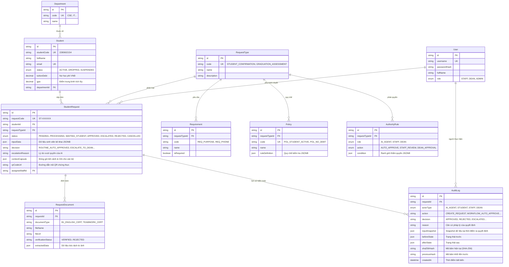

# 10. MÔ HÌNH DỮ LIỆU & LƯỢC ĐỒ CƠ SỞ DỮ LIỆU (DATABASE SCHEMA)
**Dự án:** EduRef AI — The Academic Escalation Referee

**Hệ quản trị CSDL:** Supabase PostgreSQL (kết nối qua Prisma ORM và Supavisor)
**File định nghĩa:** `backend/prisma/schema.prisma`

Runtime dùng `DATABASE_URL` từ Transaction pooler; migration dùng `DIRECT_URL` từ Session pooler qua script `npm run db:deploy`. Không đưa hai URL này vào frontend hoặc Git.

---

## 1. SƠ ĐỒ THỰC THỂ QUAN HỆ (ERD - ENTITY RELATIONSHIP DIAGRAM)

---

## 2. CÁC CỘT DỮ LIỆU ĐẶC BIỆT CẦN LƯU Ý

1. **`StudentRequest.contextCapsule` (JSONB):**
   - Lưu trữ toàn bộ bức tranh bối cảnh khi chuyển tiếp đơn lên Cán bộ (`reason`, `actionableQuestion`, `academicSnapshot`).
   - Sau khi Cán bộ duyệt: Lưu trữ thêm `reviewerNote`, `reviewedBy`, `reviewedAt` mà không làm mất đi các dữ kiện ban đầu.
2. **`StudentRequest.escalationReason` (String):**
   - **Bảo toàn 100% nguyên nhân ban đầu của Tác tử AI** (Tại sao AI không tự duyệt mà phải chuyển tiếp). Không bị ghi đè bởi ý kiến của người duyệt.
3. **`AuditLog.sha256Hash` & `AuditLog.previousHash` (String):**
   - Mắt xích hình thành chuỗi băm bất biến (Tamper-evident Hash Chain).
