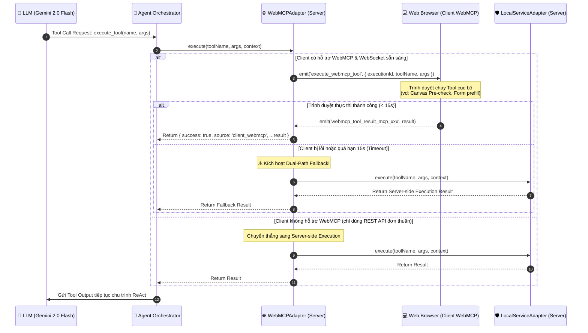

# CHUYÊN ĐỀ 13: KIẾN TRÚC TÁC TỬ PHÂN TÁN VÀ GIAO THỨC WEBMCP (HYBRID CLIENT-SERVER AGENT & DUAL-PATH FALLBACK)

> **Mục tiêu:** Phân tích giao thức **WebMCP (Web Model Context Protocol)** trong hệ thống EduRef AI, cơ chế phân tán tác vụ giữa Server Orchestrator và Trình duyệt người dùng (Client-side Execution), nguyên lý bảo mật **Zero-Trust Client Boundary**, và cơ chế chịu lỗi **Dual-Path Fallback** khi kết nối mạng gián đoạn.

---

## 1. BỐI CẢNH & ĐẶT VẤN ĐỀ

Trong các hệ thống AI Agent truyền thống, toàn bộ chu trình ReAct (Reasoning + Acting) thường bị "giam lỏng" hoàn toàn trên máy chủ (Server-side):
* **Hạn chế của mô hình đơn nhất:** Server phải gánh toàn bộ tác vụ từ suy luận LLM, OCR hình ảnh, xử lý DOM, cho đến tiền xử lý file đính kèm. Điều này gây quá tải tài nguyên tính toán (Compute Bottleneck) và tiêu tốn băng thông đường truyền lớn khi phải tải toàn bộ ảnh dung lượng cao về Server.
* **Nhu cầu Edge Computing trên Web:** Trình duyệt hiện đại của người dùng (Google Chrome, Edge) sở hữu năng lực xử lý mạnh mẽ thông qua Web APIs, HTML5 Canvas, Web Worker và thậm chí là WebGPU.

👉 **EduRef AI tích hợp giao thức WebMCP (Web Model Context Protocol)** nhằm hiện thực hóa mô hình **Hybrid Client-Server Agent**:
Cho phép Agent Orchestrator tại máy chủ có thể ủy quyền (delegate) một số công cụ tính toán thích hợp xuống thực thi trực tiếp tại Trình duyệt sinh viên thông qua kênh truyền thời gian thực WebSocket (Socket.IO).

---

## 2. KIẾN TRÚC GIAO THỨC WEBMCP & SƠ ĐỒ ĐIỀU PHỐI

Giao thức WebMCP trong EduRef AI hoạt động dựa trên mô hình Event-driven hai chiều giữa **WebMCPAdapter** (Backend) và **Client WebMCP Runtime** (Frontend).



---

## 3. CƠ CHẾ THỰC THI ĐƯỜNG ĐÔI (DUAL-PATH FALLBACK MECHANISM)

Cốt lõi an toàn của WebMCP trong EduRef AI là **Dual-Path Fallback**. Hệ thống không bao giờ đặt toàn bộ độ tin cậy vào sự ổn định của môi trường Trình duyệt.

### 3.1. Phân Tích Mã Nguồn Thực Tế (`WebMCPAdapter.js`)

Mã nguồn tại `backend/modules/ai-agent/tools/adapters/WebMCPAdapter.js` hiện thực hóa trọn vẹn cơ chế này:

```javascript
// backend/modules/ai-agent/tools/adapters/WebMCPAdapter.js
import { localServiceAdapter } from './LocalServiceAdapter.js';

export class WebMCPAdapter {
  constructor() {
    this.name = 'webmcp_adapter';
    this.timeoutMs = 15000; // Giới hạn phản hồi tối đa 15 giây
  }

  async execute(toolName, args, context = {}) {
    const { socket, clientSupportsWebMCP } = context;

    // 1. Kiểm tra điều kiện tiên quyết: Nếu không có kết nối WebSocket -> Fallback ngay lập tức
    if (!clientSupportsWebMCP || !socket) {
      return await localServiceAdapter.execute(toolName, args, context);
    }

    const startTime = Date.now();

    try {
      // 2. Thiết lập cơ chế Promise đồng bộ qua Event động
      const clientResult = await new Promise((resolve, reject) => {
        const executionId = `mcp_${Date.now()}_${Math.random().toString(36).substring(2, 7)}`;
        const eventName = `webmcp_tool_result_${executionId}`;

        const onResult = (response) => {
          clearTimeout(timer);
          resolve(response);
        };

        // Timer chống treo tiến trình Server
        const timer = setTimeout(() => {
          if (typeof socket.off === 'function') {
            socket.off(eventName, onResult);
          }
          reject(new Error(`WebMCP client execution timed out after ${this.timeoutMs}ms`));
        }, this.timeoutMs);

        // Lắng nghe 1 lần duy nhất cho executionId này
        socket.once(eventName, onResult);

        // Phát lệnh xuống trình duyệt
        socket.emit('execute_webmcp_tool', {
          executionId,
          toolName,
          args,
        });
      });

      // 3. Nếu Client báo lỗi thực thi -> Tự động kích hoạt Server Fallback
      if (clientResult?.success === false || clientResult?.error) {
        console.warn(`⚠️ [WebMCPAdapter] Client không thực thi được [${toolName}]. Kích hoạt Server Fallback!`);
        return await localServiceAdapter.execute(toolName, args, context);
      }

      return {
        success: clientResult.success !== false,
        source: 'client_webmcp',
        ...clientResult,
      };
    } catch (error) {
      // 4. Nếu timeout hoặc đứt cáp mạng -> Chuyển sang Server Fallback mà không làm chết Agent
      console.warn(`⚠️ [WebMCPAdapter] WebMCP timeout hoặc lỗi (${error.message}). Kích hoạt Dual-Path Fallback!`);
      return await localServiceAdapter.execute(toolName, args, context);
    }
  }
}
```

---

## 4. RANH GIỚI BẢO MẬT: ZERO-TRUST CLIENT BOUNDARY

Một sai lầm phổ biến khi thiết kế WebMCP là cho phép Trình duyệt thực thi các tác vụ nhạy cảm về nghiệp vụ. 

Trong EduRef AI, ranh giới bảo mật được phân định theo nguyên tắc **Zero-Trust Client Boundary**:

> [!CAUTION]
> **Client-Side (Trình duyệt) là môi trường không đáng tin cậy (Untrusted Environment).**  
> Người dùng có thể dễ dàng mở DevTools (F12), Console hoặc Network tab để sửa đổi dữ liệu phản hồi từ WebMCP. Do đó, **không bao giờ để Client ra quyết định học vụ!**

### Ma Trận Phân Định Trách Nhiệm Thực Thi

| Nhóm Tác Vụ | Nơi Thực Thi | Giao Thức | Lý do kiến trúc & bảo mật |
| :--- | :---: | :---: | :--- |
| **Quyết định Xét Tốt Nghiệp / Cấp Đơn** | **Server** | Internal Service | Ngăn chặn sinh viên tự sửa code JS để tự phê duyệt (`APPROVED`). |
| **Đánh giá Quy Chế & Nợ Tín Chỉ** | **Server** | `AcademicPolicyEngine` | Dữ liệu bảng điểm và quy chế đào tạo thuộc quyền tối cao của Nhà trường. |
| **Ghi Sổ Cái Kiểm Toán Bất Biến** | **Server** | `AuditLogService` | Ký chuỗi khối băm SHA-256 bắt buộc thực hiện trên máy chủ có bảo vệ secret. |
| **Bóc Tách Thị Giác Văn Bằng (OCR)** | **Server** | `GeminiStreamClient` | Bảo vệ Gemini API Key bí mật, không làm lộ key ra ngoài trình duyệt. |
| **Tiền xử lý ảnh (Client Pre-check)** | **Client** | **WebMCP** | Kiểm tra độ phân giải ảnh, dung lượng file, nén ảnh Base64 trước khi upload. |
| **Điều hướng & Tự điền Form (Prefill)** | **Client** | **WebMCP** | Tương tác trực quan trên giao diện: mở Modal đơn, focus vào ô cần sửa. |
| **Thu thập Context Thiết bị (Client Telemetry)** | **Client** | **WebMCP** | Thu thập User-Agent, độ phân giải màn hình, trạng thái mạng để chẩn đoán lỗi. |

---

## 5. ĐÁNH GIÁ ĐỘC LẬP: ƯU ĐIỂM & RỦI RO KỸ THUẬT

### 5.1. Ưu Điểm Đạt Được
1. **Khả năng Phục hồi Tức thì (Fault Tolerance):** Nhờ `Dual-Path Fallback`, dù người dùng đóng trình duyệt giữa lúc Agent đang suy luận, tiến trình Server vẫn hoàn thành thẩm định và lưu vết Audit đầy đủ.
2. **Hạ tải Máy chủ (Server Offloading):** Với các thao tác kiểm tra tính toàn vẹn của file ảnh hoặc định dạng dữ liệu đầu vào, việc phân tán xuống máy Client giúp tiết kiệm đáng kể CPU của Server khi có hàng nghìn sinh viên truy cập cùng lúc.
3. **Trải nghiệm Tương tác Thời gian thực (Rich UX):** Trình duyệt không chỉ là nơi hiển thị thụ động (View) mà trở thành một điểm nút tính toán cộng tác (Collaborative Edge Node) với AI Agent.

### 5.2. Các Rủi Ro & Cơ Chế Giảm Thiểu
* **Rủi ro Timeout do Mạng chập chờn (4G/Wifi yếu):** Đã khắc phục bằng `timeoutMs: 15000` kết hợp `clearTimeout` và tự động fallback về Server trong 0ms.
* **Rủi ro Memory Leak trên Socket Listener:** Đã sử dụng `socket.once(eventName, onResult)` kết hợp `socket.off()` khi timeout để đảm bảo không bị rò rỉ listener sau hàng nghìn lượt gọi tool.

---

## 6. LỘ TRÌNH PHÁT TRIỂN VÒNG CHUNG KẾT (GRAND FINALE ROADMAP)

Để đưa EduRef AI lên chuẩn mực công nghiệp cao nhất tại Vòng Chung kết Hackathon 2026, nhóm KAISER đặt ra lộ trình nâng cấp WebMCP:

1. **Chuẩn hóa theo Model Context Protocol (MCP) của Anthropic / Linux Foundation:**
   * Thay vì chỉ dùng custom Socket.IO events, triển khai đầy đủ interface JSON-RPC 2.0 theo chuẩn MCP mở, biến EduRef AI thành một MCP Server chuẩn mực có thể tích hợp vào Claude Desktop, Cursor, hoặc VS Code.
2. **Tích hợp WebLLM / WebGPU cho Edge Reasoning:**
   * Nhúng một mô hình ngôn ngữ siêu nhỏ (như SmolLM-135M hoặc Gemma-2B ONNX) chạy trực tiếp bằng WebGPU trên trình duyệt sinh viên.
   * Mô hình này sẽ thực thi qua WebMCP để làm nhiệm vụ phân loại ý định sơ bộ (Intent Routing) và chuẩn hóa ngôn ngữ tự nhiên trước khi gửi yêu cầu lên Gemini 2.0 Server, giúp giảm **40%** chi phí API token.
3. **Client-side Cryptographic Signing (WebCrypto API):**
   * Sinh viên ký số đơn học vụ bằng cặp khóa bất đối xứng (ECDSA / Ed25519) được lưu an toàn trong trình duyệt thông qua WebMCP trước khi gửi lên Server băm vào Audit Chain.

---

<div align="center">

**EduRef AI — Responsible AI Architecture with Dual-Path WebMCP.**  
*Tài liệu kỹ thuật chính thức · Đội thi KAISER · MLAI Hackathon 2026.*

</div>
