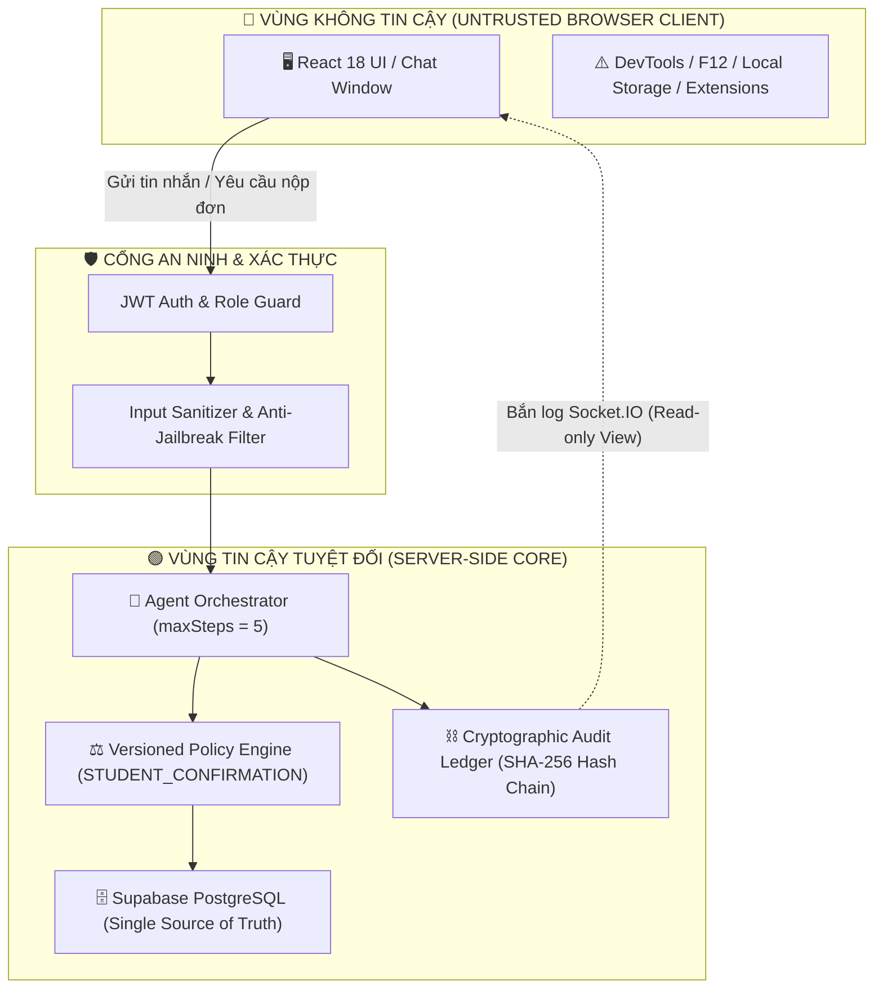

# CHUYÊN ĐỀ 13: NGUYÊN LÝ ZERO-TRUST CLIENT BOUNDARY & BẢO VỆ TOÀN VẸN QUYẾT ĐỊNH HỌC VỤ

> **Mục tiêu:** Phân tích kiến trúc an ninh bảo vệ chuỗi suy luận của Tác tử AI (Server-side Autonomous Agent), nguyên lý phân định ranh giới Zero-Trust Client Boundary, và lý do loại bỏ việc phân tán quyền thực thi xuống Trình duyệt để ngăn chặn hoàn toàn gian lận học vụ.

---

## 1. BỐI CẢNH AN NINH HỌC VỤ & RỦI RO KHI PHÂN TÁN TOOL VỀ TRÌNH DUYỆT (CLIENT-SIDE)

Trong các hệ thống tác tử tổng quát, nhiều kiến trúc thử nghiệm giao thức phân tán tác vụ (như WebMCP) cho phép Server ủy quyền cho Trình duyệt thực thi một số công cụ thông qua WebSocket. 

Tuy nhiên, trong **nghiệp vụ hành chính học vụ đại học**, việc cấp giấy xác nhận sinh viên, tạm hoãn nghĩa vụ quân sự hay xác nhận vay vốn có giá trị pháp lý ràng buộc. Việc phân tán công cụ xuống Trình duyệt sinh viên tiềm ẩn 3 rủi ro chí mạng:

1. **Rủi ro Giả mạo Dữ liệu qua DevTools / F12 (Client-Side Tampering):**
   - Người dùng có thể dễ dàng mở DevTools, Console hoặc Network tab trên trình duyệt để can thiệp vào payload phản hồi của tool trước khi gửi ngược về server.
   - Ví dụ: Sinh viên nợ học phí 15 triệu có thể chặn WebSocket để sửa thành `tuitionDebt = 0`.
2. **Ảo giác Phân cấp Thẩm quyền (Authority Leakage):**
   - Nếu Trình duyệt được quyền tham gia vào quá trình thẩm định, AI có thể bị đánh lừa bởi các dữ liệu đã bị client sửa đổi, dẫn đến tự động duyệt những trường hợp vi phạm quy chế.
3. **Mất Tính Minh Bạch Của Sổ Cái Kiểm Toán (Audit Ledger Invalidation):**
   - Mọi bản ghi trong chuỗi băm SHA-256 phải bắt nguồn từ dữ liệu xác thực trực tiếp từ cơ sở dữ liệu nhà trường. Dữ liệu từ trình duyệt không thể đảm bảo tính bất biến (Immutability).

---

## 2. NGUYÊN TẮC THIẾT KẾ: ZERO-TRUST CLIENT BOUNDARY

Để giải quyết triệt để các rủi ro trên, **EduRef AI áp dụng triết lý Zero-Trust Client Boundary**:

### 3 Quy Tắc Bất Di Bất Dịch:

1. **Trình duyệt chỉ là giao diện vào/ra (Read-only I/O View):**
   - Frontend chỉ gửi tin nhắn thô của sinh viên và nhận phản hồi hiển thị. Trình duyệt không chứa bất kỳ logic quyết định hay công cụ thẩm định nào.
2. **Nguồn Chân Lý Duy Nhất (Single Source of Truth):**
   - Mọi thông tin về trạng thái sinh viên (`ACTIVE`, `DROPPED`, `SUSPENDED`), nợ học phí, khoa viện đều được truy vấn trực tiếp từ Database Server thông qua Prisma ORM.
3. **Sổ Cái Kiểm Toán Bất Biến (Cryptographic Hash Chain):**
   - Mọi hành động gọi tool, phân loại ý định, kết quả thẩm định đều được băm SHA-256 ngay tại Server và lưu vào cơ sở dữ liệu cùng Transaction, sinh viên không thể xóa dấu vết.

---

## 3. KẾT LUẬN & ĐÁNH GIÁ CHUẨN DOANH NGHIỆP

Việc tinh gọn kiến trúc, loại bỏ hoàn toàn các adapter phân tán mồ côi (WebMCP) để tập trung vào **Server-side Autonomous Agent** giúp EduRef AI:
- Đạt chuẩn **Clean Repository**: Không còn ghost code, không còn dead code.
- Bảo vệ **100% tính toàn vẹn** của quy trình cấp Giấy Xác Nhận Sinh Viên.
- Sẵn sàng giải trình minh bạch trước Ban Giám Khảo Doanh nghiệp tại Vòng Chung kết.
