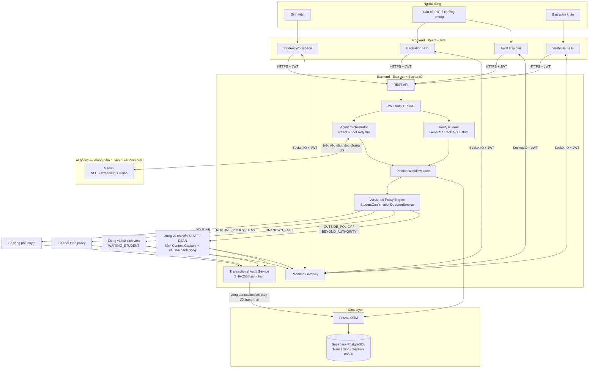

# EduRef AI — Academic Escalation Referee

EduRef AI là bản triển khai Đề A, track VNG/OrganizationAI của MLAI Hackathon 2026. MVP tập trung vào **một quy trình hẹp**: cấp giấy xác nhận sinh viên theo policy có phiên bản, tự hoàn tất ca thường quy và dừng đúng lúc khi thiếu dữ kiện, ngoài policy hoặc vượt thẩm quyền.

## Hành vi cốt lõi

| Tình huống | Phân loại | Hành động |
|---|---|---|
| Thiếu mục đích | `UNKNOWN_FACT` | Hỏi một câu trực tiếp |
| Policy quy định rõ không đủ điều kiện | `ROUTINE_POLICY_DENY` | Từ chối theo policy |
| Mục đích chưa được policy bao phủ | `OUTSIDE_POLICY` | Chuyển cán bộ, không tự suy diễn |
| Yêu cầu ngoại lệ/phê duyệt miệng | `BEYOND_AUTHORITY` | Chuyển cán bộ với câu hỏi xác minh |
| Ca hợp lệ thường quy | `ROUTINE` | Tự động phê duyệt và ghi audit |

Nguồn chân lý: [`EDUREF_AI/backend/services/StudentConfirmationDecisionService.js`](EDUREF_AI/backend/services/StudentConfirmationDecisionService.js).

## Verify theo đề

- **General Verify:** 4 ca, có PASS/FAIL và timestamp.
- **Track A Verify:** 5 ca, đúng **3 routine auto + 2 escalated**.
- **Judge sandbox:** nhận một ca mơ hồ mới và chạy qua cùng policy engine.
- Bộ dữ liệu policy có 15 ca và unit test bằng Node test runner.

Không có kết quả “100%” điền sẵn. Hai chỉ số missed/false escalation được để `null` cho đến khi đo trên tập độc lập có nhãn.

## Chạy dự án

Yêu cầu Node.js 18+ và một project Supabase.

```bash
cd EDUREF_AI/backend
npm ci
cp .env.example .env
# Điền DATABASE_URL (Transaction pooler) và DIRECT_URL (Session pooler) từ Supabase.
# Giữ ALLOW_DEMO_ROLE_SWITCH=true chỉ cho bản chấm thi dùng dữ liệu synthetic.
npm run db:deploy
# Chỉ trên project Supabase demo/disposable: đặt ALLOW_DESTRUCTIVE_SEED=true
npm run seed
npm start
```

```bash
cd EDUREF_AI/frontend
npm ci
cp .env.example .env
npm run dev
```

Backend mặc định `http://localhost:5000`, frontend `http://localhost:5173`.

## Kiểm tra trước demo

```bash
cd EDUREF_AI/backend
npm test
npx prisma validate

cd ../frontend
npm run build
```

Kịch bản trình diễn: [`EDUREF_AI/RUNBOOK.md`](EDUREF_AI/RUNBOOK.md). Policy đầy đủ: [`EDUREF_AI/docs/14_TRACK_A_POLICY.md`](EDUREF_AI/docs/14_TRACK_A_POLICY.md). Verify: [`EDUREF_AI/docs/08_VERIFY.md`](EDUREF_AI/docs/08_VERIFY.md).

## Kiến trúc



Luồng quyết định cuối luôn đi qua policy engine có phiên bản. Gemini chỉ hỗ trợ hiểu ngôn ngữ tự nhiên, streaming và vision; mô hình không được tự ý phê duyệt ngoại lệ hoặc vượt qua RBAC.

- React/Vite: workspace sinh viên, hàng đợi cán bộ, Verify Harness, Audit Explorer.
- Express/Socket.IO: REST + realtime đã xác thực JWT.
- Prisma/Supabase PostgreSQL: hồ sơ, policy, authority và audit log; runtime dùng connection pooler.
- Gemini: hiểu ngôn ngữ tự nhiên/vision; quyết định cuối do policy engine xác định.
- SHA-256 hash chain: audit tamper-evident; auto-approve và bằng chứng audit được ghi cùng transaction.

## Dữ liệu và giới hạn

Dữ liệu seed là **synthetic demo data**. Không sử dụng dữ liệu sinh viên thật nếu chưa có thông báo, đồng thuận/cơ sở xử lý, kiểm soát truy cập và chính sách lưu trữ phù hợp. Hướng dẫn Supabase nằm tại [`EDUREF_AI/docs/16_SUPABASE_DEPLOYMENT.md`](EDUREF_AI/docs/16_SUPABASE_DEPLOYMENT.md); các rủi ro còn lại tại [`EDUREF_AI/docs/11_SECURITY.md`](EDUREF_AI/docs/11_SECURITY.md).
