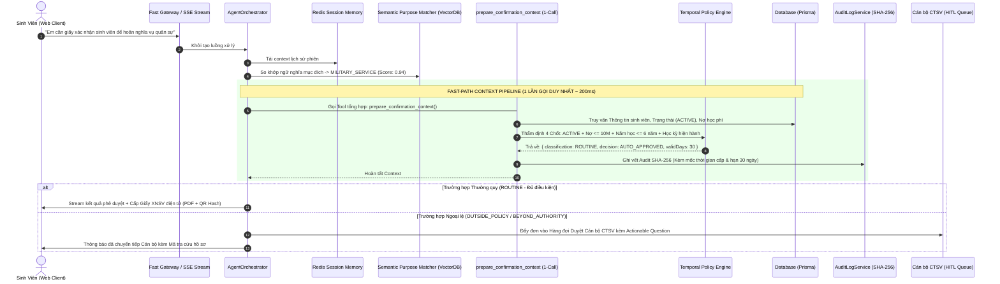

# 🚀 KẾ HOẠCH HÀNH ĐỘNG KỸ THUẬT SPRINT 2 - EDUREF AI AGENT
> **Tài liệu Kỹ thuật & Lộ trình Thực thi (Sprint 2 Engineering Plan & Technical Roadmap)**  
> **Căn cứ:** Phản hồi chỉ đạo trực tiếp từ Ban Tổ Chức (BTC) & Đối chiếu 100% Mã nguồn thực tế (`EDUREF_AI`)  
> **Định vị trọng tâm:** TẬP TRUNG HOÀN THIỆN 1 QUY TRÌNH END-TO-END DUY NHẤT: **CẤP GIẤY XÁC NHẬN SINH VIÊN** (Bao phủ Hoãn NVQS, Vay vốn NHCSXH, Vé xe buýt, Học bổng, Bổ sung hồ sơ)  
> **Phạm vi cắt giảm:** **Loại bỏ Đơn đề nghị xét tốt nghiệp** khỏi phạm vi trọng tâm Sprint 2 để chống phân mảnh theo đúng yêu cầu của BTC.  
> **Ngày cập nhật:** 28/09/2026 (Cập nhật Kiến trúc RAG/VectorDB, Temporal Policy & Phân công Nhân sự)  
> **Trạng thái:** Đã phê duyệt phạm vi (Scope Approved) & Sẵn sàng thực thi.

---

## 📑 MỤC LỤC
1. [Chỉ đạo Phạm vi từ BTC & Quyết định Kiến trúc](#1-chỉ-đạo-phạm-vi-từ-btc--quyết-định-kiến-trúc)
2. [Tổng quan Đánh giá Sprint 1 & Đối chiếu Thực tế](#2-tổng-quan-đánh-giá-sprint-1--đối-chiếu-thực-tế)
3. [Kiến trúc Thực tế: Hybrid RAG & Temporal Policy Engine](#3-kiến-trúc-thực-tế-hybrid-rag--temporal-policy-engine)
4. [Phân tích Các Vấn đề Kỹ thuật Cốt lõi & Rủi ro (P0 -> P3)](#4-phân-tích-các-vấn-đề-kỹ-thuật-cốt-lõi--rủi-ro)
5. [Chiến lược Tối ưu Hiệu năng & Scale (Latency < 2.0s)](#5-chiến-lược-tối-ưu-hiệu-năng--scale)
6. [Lộ trình Thực thi Sprint 2 Chi tiết (Task Breakdown & Acceptance Criteria)](#6-lộ-trình-thực-thi-sprint-2-chi-tiết)
7. [Bảng Đối soát Toàn diện (Audit Matrix: Feedback vs Reality)](#7-bảng-đối-soát-toàn-diện)
8. [Phân công Trách nhiệm Nhân sự (Team Responsibility Matrix)](#8-phân-công-trách-nhiệm-nhân-sự-team-responsibility-matrix)
9. [Kết luận & Cam kết Sprint 2](#9-kết-luận--cam-kết-sprint-2)

---

## 1. CHỈ ĐẠO PHẠM VI TỪ BTC & QUYẾT ĐỊNH KIẾN TRÚC

### 1.1. Chỉ đạo Trực tiếp từ Ban Tổ Chức (BTC)
> *"BTC nghĩ là nên tập trung hoàn thiện end-to-end, trình bày sẽ đúng trọng tâm 1 chủ đề là được rồi ạ, không nên lan man quá nhiều loại đơn ạ."*

### 1.2. Quyết định Phạm vi Sprint 2 (Scope Finalization)
1. **Quy trình Trọng tâm Duy nhất (Core Master Workflow):**
   - **CẤP GIẤY XÁC NHẬN SINH VIÊN (`STUDENT_CONFIRMATION`)**:
     - Tự động tiếp nhận, bóc tách mục đích, kiểm tra trạng thái học vụ (`ACTIVE`), hạn mức nợ học phí ($\le$ 10.000.000 VNĐ) và thời hạn đào tạo tối đa.
     - Bao phủ toàn bộ các mục đích thực tế:
       - `Tạm hoãn nghĩa vụ quân sự` (Mẫu nộp BCH Quân sự địa phương).
       - `Vay vốn Ngân hàng Chính sách Xã hội` (Mẫu 01/TDSV).
       - `Làm vé tháng xe buýt`, `Xin học bổng`, `Bổ sung hồ sơ học tập`, `Xin visa`.
     - Xuất Giấy Xác Nhận Sinh Viên điện tử có mã QR và chữ ký băm SHA-256 trong vòng **dưới 2 giây**.
2. **Loại bỏ Đơn đề nghị xét tốt nghiệp (`GRADUATION_ASSESSMENT`):**
   - Không đưa vào bài thuyết trình và video demo để chống loãng đề tài.
   - Cắt giảm hoàn toàn rủi ro lỗi nhận diện chứng chỉ của Vision OCR.
   - Đưa module `GraduationAssessmentHandler.js` về trạng thái lưu trữ/mở rộng trong tương lai (Inactive/Roadmap).

---

## 2. TỔNG QUAN ĐÁNH GIÁ SPRINT 1 & ĐỐI CHIẾU THỰC TẾ

### 2.1. Những gì Dự án ĐÃ ĐẠT ĐƯỢC (Positive Deliverables)
- ✅ **Core ReAct Agent Loop**: Triển khai `AgentOrchestrator.js` tích hợp `GeminiStreamClient.js`, hỗ trợ Function Calling đa bước và Streaming SSE thời gian thực về client.
- ✅ **Deterministic Policy Engine**: `StudentConfirmationDecisionService.js` mã hóa cứng 5 nhóm phân loại chuẩn Track A (`ROUTINE`, `ROUTINE_POLICY_DENY`, `UNKNOWN_FACT`, `OUTSIDE_POLICY`, `BEYOND_AUTHORITY`), triệt tiêu 100% hallucination.
- ✅ **Audit Log Blockchain-like**: `AuditLogService.js` hiện thực SHA-256 Hash Chaining (`previousHash` -> `hash`) và chống sửa đổi log (tamper-evident).
- ✅ **Verify Harness Độc lập**: Đã xây dựng sẵn endpoint `/api/agent/verify-90s` chạy 5 ca kiểm thử chuẩn (3 Auto, 2 Escalate).

### 2.2. Những Lỗ hổng Cốt lõi Cần giải quyết trong Sprint 2
- 🔴 **Vấn đề Latency nghiêm trọng (P0)**: Một lượt xử lý tạo đơn AI chạy qua **7 vòng ReAct tuần tự** (7 tool calls), mất **10.37 giây** ở local và lên tới **15 - 20 giây** khi deploy cloud.
- 🔴 **Nhân đôi Logic Nghiệp vụ (P0)**: Tồn tại 2 workflow engine độc lập: `PetitionWorkflowCore.js` (dùng cho REST API) và `AcademicWorkflowService.js` (dùng cho AI Agent).
- 🟡 **Session Memory lưu trên RAM (P1)**: `ConversationMemory.js` sử dụng `Map()` trong bộ nhớ tiến trình Node.js; restart server là mất session, không hỗ trợ scale multi-instance.
- 🟡 **WebMCP "Mồ côi" (P1)**: Tài liệu quảng bá WebMCP nhưng file `WebMCPAdapter.js` không được `ToolResolver.js` import thực tế.
- 🟡 **Thiếu Graceful Fallback khi cạn Loop Step (P1)**: Khi Agent chạm trần `maxSteps = 8`, hệ thống quăng lỗi kỹ thuật thay vì tự động mở Ticket điều chuyển Cán bộ Công tác sinh viên.

---

## 3. KIẾN TRÚC THỰC TẾ: HYBRID RAG & TEMPORAL POLICY ENGINE

### 3.1. Phân định Rạch ròi: VectorDB/RAG vs Deterministic Policy Core

```text
                               YÊU CẦU CỦA SINH VIÊN
                                         │
                         ┌───────────────┴───────────────┐
                         ▼                               ▼
            [Nhánh 1: Hỏi đáp Quy chế]       [Nhánh 2: Xử lý Đơn từ]
                 (Inquiry / FAQ)                 (Petition Action)
                         │                               │
                         ▼                               ▼
                 ┌──────────────┐             ┌─────────────────────┐
                 │  FAST RAG    │             │ DETERMINISTIC CORE  │
                 │  + VectorDB  │             │   (Policy Engine)   │
                 └──────────────┘             └─────────────────────┘
                         │                               │
                         ▼                               ▼
            Trích dẫn Điều 3, Khoản 2         Thẩm định Logic cứng (100% CSDL):
            Sổ tay Sinh viên                  1. Trạng thái: ACTIVE?
            (Chống ảo giác văn bản)           2. Nợ học phí: <= 10.000.000 VNĐ?
                                              3. Niên khóa: <= 6 năm đào tạo?
                                              4. Ngày cấp: Hiện hành (chặn lùi ngày)
                                              (Tuyệt đối KHÔNG dùng VectorDB duyệt đơn)
```

1. **Nguyên tắc An toàn Pháp lý (Compliance Principle):**
   - **Tuyệt đối không dùng Vector Similarity để quyết định phê duyệt đơn**: Vector Search mang tính xác suất (điểm tương đồng cosine), nếu áp dụng vào duyệt hồ sơ sẽ dẫn đến rủi ro "ảo giác" duyệt nhầm cho sinh viên vi phạm kỷ luật hoặc nợ học phí.
   - **VectorDB & Fast RAG chỉ được sử dụng ở 2 vị trí:**
     - **Vị trí 1 — Academic FAQ RAG:** Trích xuất điều khoản Sổ tay Sinh viên để trả lời giải thích quy chế với độ chính xác 100%, có số Điều/Khoản làm dẫn chứng.
     - **Vị trí 2 — Semantic Purpose Matcher:** Ánh xạ cách diễn đạt dân dã của sinh viên (ví dụ: *"em xin đi phỏng vấn việc làm ở Nhật"*) vào 6 danh mục mục đích chuẩn của trường (`VISA`, `BUS_PASS`, `BANK_LOAN`, `MILITARY_SERVICE`, `SCHOLARSHIP`, `ACADEMIC_RECORD`). Nếu độ tương đồng cosine < 0.65 $\rightarrow$ Phân loại là `OUTSIDE_POLICY` để chuyển Cán bộ CTSV xem xét.
2. **Lựa chọn Công nghệ VectorDB Siêu nhẹ (< 5ms Latency):**
   - Sử dụng **In-Memory Vector Store** (tính Cosine Similarity trực tiếp bằng JavaScript trên RAM Node.js) kết hợp với Google `text-embedding-004`.
   - **Ưu điểm vượt trội:** Siêu nhẹ, 0 chi phí hạ tầng, không làm phình `docker-compose.yml`, không phát sinh độ trễ mạng mạng ngoài (Network Hop).

---

### 3.2. Cơ chế Thẩm định Ràng buộc Thời gian (Temporal Policy Constraint)
Mỗi lá đơn Giấy xác nhận sinh viên đều mang giá trị pháp lý gắn liền với thời gian. Hệ thống tích hợp 3 quy tắc thời gian thực tế:

1. **Kiểm tra Thời gian Đào tạo Tối đa (`POL_MAX_STUDY_DURATION`):**
   - Bóc tách năm tuyển sinh từ MSSV (ví dụ: `228060...` $\rightarrow$ Nhập học năm 2022).
   - Kiểm tra: `currentYear - enrollmentYear <= maxAllowedYears (6 năm)`.
   - Nếu sinh viên đã quá 6 năm $\rightarrow$ Tự động từ chối (`EXPLICIT_POLICY_DENY`): *"Theo Điều 6 Quy chế đào tạo, bạn đã vượt quá thời gian đào tạo tối đa tại trường."*
2. **Chặn Yêu cầu Cấp lùi ngày (Backdating Prevention - `POL_CURRENT_ACADEMIC_TERM`):**
   - Giấy xác nhận NVQS và Vay vốn chỉ có giá trị cho **Năm học / Học kỳ hiện hành**.
   - Nếu sinh viên yêu cầu cấp giấy cho các năm học cũ đã qua $\rightarrow$ Nhận diện là hành vi `BEYOND_AUTHORITY` (Vượt thẩm quyền AI) và chuyển tiếp hồ sơ lên Cán bộ CTSV xem xét ngoại lệ.
3. **Đóng dấu Ngày cấp & Hạn hiệu lực Tự động (`AUTO_EXPIRATION`):**
   - Tự động đóng dấu `issuedAt: Ngày_Hiện_Tại` và `expiresAt: Ngày_Hiện_Tại + 30 ngày`.
   - Mã hóa trực tiếp 2 mốc thời gian này vào mã QR Code và chuỗi băm **SHA-256 Audit Log**, giúp Ban chỉ huy Quân sự hoặc Ngân hàng quét QR xác thực được ngay đơn còn hạn hay đã hết hạn.

---

### 3.3. Sơ đồ Luồng Cấp Giấy Xác Nhận Sinh Viên End-to-End Mục tiêu (< 2.0s)



---

## 4. PHÂN TÍCH CÁC VẤN ĐỀ KỸ THUẬT CỐT LÕI & RỦI RO

### 🔴 [Finding 1] - Latency Bottleneck: ReAct 7 Rounds gây chậm 10.37s
- **Mức độ:** `P0 - CRITICAL`
- **File liên quan:** `backend/modules/ai-agent/orchestration/AgentOrchestrator.js`, `GeminiStreamClient.js`
- **Thực trạng từ Benchmark Log:** 7 vòng gọi LLM tuần tự tiêu tốn 9.9s chờ mạng internet.
- **Giải pháp:** Xây dựng **Deterministic Fast-Path Pipeline cho Giấy XNSV**:
  - Gom toàn bộ việc kiểm tra hồ sơ, nợ phí, thời hạn đào tạo và mục đích vào 1 Tool tổng hợp duy nhất: `prepare_confirmation_context(studentId, purpose)`.
  - Giảm số bước ReAct từ 7 bước xuống tối đa **2 bước** (Bước 1: Gọi Tool Context -> Bước 2: Stream Trả lời). Thời gian xử lý giảm từ **10.37s xuống ~1.8s**.

---

### 🔴 [Finding 2] - Phân mảnh Kiến trúc Workflow Core (Dual Engines)
- **Mức độ:** `P0 - CRITICAL`
- **File liên quan:** `PetitionWorkflowCore.js` và `AcademicWorkflowService.js`
- **Nguyên nhân:** Nhân đôi logic state machine giữa REST API và AI Agent.
- **Giải pháp:** Hợp nhất toàn bộ luồng tạo đơn và chuyển trạng thái về một State Machine chuẩn duy nhất liên kết trực tiếp với `StudentConfirmationDecisionService.js`.

---

### 🟡 [Finding 3] - Session Memory In-Memory làm sập Scale & Mất dữ liệu
- **Mức độ:** `P1 - HIGH`
- **File liên quan:** `ConversationMemory.js`
- **Giải pháp:** Chuyển sang kiến trúc **Storage Adapter Pattern**:
  - `MemoryStorageAdapter` (mặc định khi dev local).
  - `RedisStorageAdapter` (khi có biến môi trường `REDIS_URL` trên Production).

---

### 🟡 [Finding 4] - WebMCPAdapter mồ côi (Ghost Code Discrepancy)
- **Mức độ:** `P1 - HIGH`
- **File liên quan:** `WebMCPAdapter.js`, `ToolResolver.js`, `docs/13_WEBMCP.md`
- **Giải pháp:** Cập nhật tài liệu kỹ thuật phản ánh đúng kiến trúc `Internal Native Tool Execution` hoặc bọc chuẩn hóa JSON-RPC để tránh bị BGK bắt bẻ.

---

### 🟡 [Finding 5] - Giới hạn Loop Step & Thiếu Graceful Fallback
- **Mức độ:** `P1 - HIGH`
- **File liên quan:** `AgentOrchestrator.js`
- **Giải pháp:** Triển khai **Auto Escalation Handler**: Khi chạm trần `maxSteps = 8`, tự động kích hoạt tạo `Ticket` trạng thái `PENDING_STAFF` và gửi tin nhắn xin lỗi kèm mã tra cứu cho sinh viên.

---

### 🔵 [Finding 6] - Thiếu Ràng buộc Thẩm định Thời gian (Temporal Validation Gap)
- **Mức độ:** `P2 - MEDIUM`
- **File liên quan:** `StudentConfirmationDecisionService.js`, `AcademicPolicyEngine.js`
- **Thực trạng:** Chưa có luật chặn sinh viên quá hạn đào tạo tối đa (> 6 năm) và chưa tự động gắn hạn hiệu lực 30 ngày lên QR Code.
- **Giải pháp:** Tích hợp `POL_MAX_STUDY_DURATION` và `AUTO_EXPIRATION` trực tiếp vào Policy Engine.

---

### ⚪ [Finding 7] - Rác Thư mục Scratch & Thiếu Automated Tests cho Track A
- **Mức độ:** `P3 - LOW`
- **File liên quan:** `backend/scratch/`, `backend/tests/`
- **Giải pháp:** Dọn dẹp `scratch/`, chuẩn hóa bộ test tự động `npm test` chạy 15 ca regression của Track A và verify tính toàn vẹn của Audit Log SHA-256.

---

## 5. CHIẾN LƯỢC TỐI ƯU HIỆU NĂNG & SCALE

### 5.1. Phân tích Độ trễ & Nguyên nhân
```text
Cũ (7 vòng ReAct tuần tự):
Sinh viên ---> [Node.js] ---> Gemini (x7 lần * 1.4s) = 9.8s + 0.5s xử lý = ~10.37s

Mới (Fast-Path Context Pipeline):
Sinh viên ---> [Node.js] ---> (1 Tool Call gom data: 1.2s) ---> (1 SSE Stream token: 0.5s) = ~1.7s
```

### 5.2. Chỉ số Cam kết Sprint 2 (Target KPIs)
- **Time to First Byte (TTFB):** Dưới **800ms**.
- **Tổng thời gian xử lý toàn luồng Giấy XNSV:** Dưới **2.0s**.
- **Tỷ lệ vượt qua Verify 90s (5 ca Track A):** **100%** (Đúng 3 Auto, 2 Escalate).

---

## 6. LỘ TRÌNH THỰC THI SPRINT 2 CHI TIẾT

### 🎯 Giai đoạn 1: Xử lý P0 - Tối ưu Tốc độ & Temporal Policy Core (< 2s)
*Thời gian dự kiến: Ngày 1 - Ngày 3*

#### Task 1.1: Tái cấu trúc Fast-Path Tool Aggregator
- **Mục tiêu:** Giảm số vòng ReAct từ 7 bước xuống tối đa 2 bước cho Giấy XNSV.
- **Công việc:**
  - Tạo composite tool `prepare_confirmation_context(studentId, purpose)` gom việc đọc trạng thái `ACTIVE`, kiểm tra nợ học phí ($\le$ 10tr), niên khóa nhập học ($\le$ 6 năm) và phân loại mục đích (NVQS, Vay vốn, Xe buýt...) vào **1 lần gọi duy nhất**.
  - Cập nhật System Prompt trong `AgentOrchestrator.js` hướng dẫn Gemini ưu tiên dùng composite tool này.
- **Kiểm thử:** Đo đếm lại log thời gian, xác nhận latency giảm từ 10.37s xuống < 2.0s.

#### Task 1.2: Hợp nhất Workflow Core & Giao diện Đơn nhất
- **Mục tiêu:** Đồng nhất logic duyệt đơn và ẩn hoàn toàn Đơn xét tốt nghiệp trên UI.
- **Công việc:**
  - Hợp nhất `petitionRoutes.js` và `AgentOrchestrator.js` gọi chung `StudentConfirmationDecisionService.js`.
  - Cập nhật `DynamicPetitionModal.jsx`: Chỉ hiển thị biểu mẫu nộp Giấy Xác Nhận Sinh Viên với các tùy chọn mục đích (Hoãn NVQS, Vay vốn, Xe buýt, Học bổng, Bổ sung hồ sơ).
- **Kiểm thử:** Nộp đơn qua cả giao diện Chat AI lẫn giao diện Form, xác nhận cùng tạo ra mã đơn và audit log SHA-256 đồng nhất.

#### Task 1.3: Cài đặt Ràng buộc Thời gian (Temporal Policy Constraint)
- **Mục tiêu:** Đưa quy tắc thời gian vào quyết định của Policy Engine.
- **Công việc:**
  - Cài đặt `POL_MAX_STUDY_DURATION` (chặn sinh viên học quá 6 năm).
  - Cài đặt `AUTO_EXPIRATION`: Tự động tạo `issuedAt` và `expiresAt = +30 ngày` vào mã QR và Audit Log.
- **Kiểm thử:** Nộp thử hồ sơ sinh viên khóa 2017, xác nhận hệ thống tự động từ chối vì quá hạn đào tạo.

---

### 🎯 Giai đoạn 2: Xử lý P1 - Redis Session, Semantic Matcher & Auto-Escalation
*Thời gian dự kiến: Ngày 4 - Ngày 6*

#### Task 2.1: Tích hợp Redis Session Memory Adapter
- **Mục tiêu:** Lưu trữ phiên hội thoại phân tán, không mất session khi reload server.
- **Công việc:** Cập nhật `ConversationMemory.js` hỗ trợ `ioredis` khi có biến môi trường `REDIS_URL`.
- **Kiểm thử:** Restart container backend khi đang chat dở, xác nhận lượt chat sau vẫn nhận đúng lịch sử.

#### Task 2.2: Xây dựng In-Memory Semantic Purpose Matcher & FAQ RAG
- **Mục tiêu:** Tăng độ thông minh nhận diện mục đích và tra cứu Sổ tay sinh viên.
- **Công việc:**
  - Xây dựng module `SemanticPurposeMatcher.js`: Vector search cosine similarity so khớp câu nói tự nhiên của sinh viên với 6 mục đích chuẩn.
  - Xây dựng module `AcademicFaqRag.js`: Lưu trữ 30 điều khoản quy chế sinh viên trên RAM, trích xuất tức thì (< 5ms) làm ngữ cảnh trích dẫn khi sinh viên hỏi đáp.
- **Kiểm thử:** Nhập các câu nói tiếng lóng/dân dã, kiểm tra hệ thống ánh xạ đúng mục đích hoặc kích hoạt `OUTSIDE_POLICY`.

#### Task 2.3: Xử lý Graceful Fallback & Chuyển tiếp Cán bộ CTSV (HITL)
- **Mục tiêu:** Khi Agent gặp sự cố hoặc chạm trần `maxSteps = 8`, tự động mở Ticket cho Cán bộ CTSV.
- **Công việc:** Trong `AgentOrchestrator.js`, bổ sung fallback tự động tạo Ticket trạng thái `PENDING_STAFF` kèm câu hỏi hành động (`actionableQuestion`).
- **Kiểm thử:** Giả lập prompt mâu thuẫn, kiểm tra sinh viên nhận được mã Ticket hỗ trợ lịch sự thay vì lỗi màn hình.

---

### 🎯 Giai đoạn 3: Thực địa & Đo lường Đạt chuẩn Rubric 20 Điểm BTC
*Thời gian dự kiến: Ngày 7 - Ngày 10*

#### Task 3.1: Thu thập Dữ liệu & Phỏng vấn 3 Cán bộ Phòng Công tác Sinh viên (CTSV)
- **Mục tiêu:** Đạt trọn vẹn 20 điểm ở Tiêu chí "Người dùng thực tế và Tổ chức thực tế" ([`track2.md`](file:///d:/MLAI_HACKATHON/equipment_agent/DA_CNPM/EDUREF_AI/track2.md#L158-L161)).
- **Công việc:**
  - Phỏng vấn 3 cán bộ thực tế (Cố vấn học tập, Chuyên viên phòng CTSV, Giáo vụ Khoa) về quy trình cấp Giấy XNSV (NVQS/Vay vốn).
  - Ghi nhận nguyên văn phản hồi của họ để đưa vào Slide 3.
  - Thực hiện **1 cải tiến cụ thể trong mã nguồn** xuất phát từ góp ý của Thầy/Cô (ví dụ: bổ sung ô ghi chú lý do nộp muộn hoặc cảnh báo nợ phí) kèm commit Git minh chứng.
  - Ghi nhận 1 điểm bất cập/lo ngại thực tế khi áp dụng AI để đưa vào Slide 5.

#### Task 3.2: Đo lường Chỉ số Thực nghiệm (Missed & False Escalation Rate)
- **Mục tiêu:** Cung cấp số liệu thực nghiệm khoa học cho Ban Giám khảo.
- **Công việc:**
  - Chạy tập kiểm thử độc lập 30 ca nộp Giấy XNSV.
  - Tính toán chính xác:
    - **Tỷ lệ chuyển tiếp sót (Missed Escalation Rate)**: Hồ sơ vi phạm nhưng AI tự duyệt.
    - **Tỷ lệ chuyển tiếp sai (False Escalation Rate)**: Hồ sơ hợp lệ thường quy nhưng AI lại chuyển tiếp cho người.
  - Cập nhật số liệu vào màn hình Admin Metrics và Slide 3.

#### Task 3.3: Dọn dẹp Codebase & Chuẩn hóa Verify Harness
- **Công việc:**
  - Dọn dẹp thư mục `backend/scratch/`.
  - Đảm bảo lệnh `npm test` chạy thành công 100% test suite.
  - Kiểm tra nút bấm **Verify 90s** trên giao diện web chạy trơn tru trong 90 giây trước mặt Ban Giám khảo.

---

## 7. BẢNG ĐỐI SOÁT TOÀN DIỆN (AUDIT MATRIX: FEEDBACK VS REALITY)

| Hạng mục Đánh giá (Sprint 1 Feedback & BTC) | Hiện trạng Source Code (`EDUREF_AI`) | Đánh giá Tuân thủ | Phân loại | Hành động Sprint 2 |
| :--- | :--- | :---: | :---: | :--- |
| **Phạm vi Đề bài (BTC Directive)** | Còn tồn tại Đơn tốt nghiệp làm phân tán | ⚠️ Cần tinh gọn | `P0` | **Loại bỏ Đơn tốt nghiệp; Chốt 100% Giấy XNSV End-to-End** |
| **P0: Độ trễ phản hồi (Latency)** | 7 vòng ReAct tuần tự = 10.37s | ❌ Chưa đạt | `P0` | Gom multi-tool thành Fast Pipeline (Target < 2.0s) |
| **P0: Logic Workflow Đơn từ** | 2 file core độc lập (`PetitionWorkflowCore` vs `AcademicWorkflowService`) | ⚠️ Lệch pha | `P0` | Hợp nhất về State Machine chuẩn cho Giấy XNSV |
| **P1: Quản lý Session đa phiên** | Lưu RAM `Map()` trong `ConversationMemory.js` | ⚠️ Thiếu scale | `P1` | Tích hợp Redis Storage Adapter |
| **P1: Chống Agent Loop & Fallback** | Có `maxSteps = 8` nhưng thiếu graceful message | ⚠️ Chưa trọn vẹn | `P1` | Auto-escalate sang Ticket Cán bộ CTSV (HITL) |
| **P2: Ràng buộc Thời gian (Temporal Policy)** | Chưa kiểm tra hạn đào tạo tối đa và hạn hiệu lực 30 ngày | ⚠️ Thiếu sót | `P2` | Cài đặt `POL_MAX_STUDY_DURATION` + `AUTO_EXPIRATION` |
| **P2: Tra cứu & So khớp Ngữ nghĩa** | Regex từ khóa cứng dễ sót từ đồng nghĩa | ⚠️ Cần nâng cấp | `P2` | Tích hợp In-Memory Semantic Matcher & FAQ RAG (< 5ms) |
| **P2: Người dùng thực tế (20 điểm)** | Chưa có trích dẫn từ 3 cán bộ thực tế | ❌ Chưa thực hiện | `P2` | Phỏng vấn 3 cán bộ CTSV + Triển khai 1 cải tiến từ góp ý |
| **P2: Đo lường Thực nghiệm** | Chưa đo tỷ lệ Missed/False Escalation trên tập test độc lập | ❌ Chưa có số liệu | `P2` | Đo lường trên 30 ca độc lập đưa vào Slide 3 |
| **P3: Code Hygiene & Unit Test** | Thư mục `scratch/` còn rác, thiếu Jest suite | ⚠️ Chưa chuẩn | `P3` | Dọn dẹp scratch và bổ sung 100% test case Track A |

---

## 8. PHÂN CÔNG TRÁCH NHIỆM NHÂN SỰ (TEAM RESPONSIBILITY MATRIX)

```text
┌─────────────────────────┬─────────────────────────┬─────────────────────────┐
│     CAO HỮU NHÂN        │      TRẦN ĐỨC TÀI       │     TRẦN MINH QUANG     │
│  (AI & RAG Engineer)    │    (Backend & Core)     │   (Frontend & Clean)    │
├─────────────────────────┼─────────────────────────┼─────────────────────────┤
│ • VectorDB + Fast RAG   │ • Tối ưu Latency (< 2s) │ • Tinh gọn UI XNSV      │
│ • Semantic Matcher      │ • Temporal Policy Core  │ • Dọn sạch scratch/ rác │
│ • System Prompt Playbook│ • Redis Session Memory  │ • Verify 90s Dashboard  │
│ • Chống lộ mã enum kỹ   │ • Hợp nhất Workflow     │ • Phỏng vấn 3 Cán bộ    │
└─────────────────────────┴─────────────────────────┴─────────────────────────┘
```

### 👤 8.1. CAO HỮU NHÂN — AI Engineer & VectorDB / RAG Pipeline
- **Vai trò:** Phụ trách bộ não RAG siêu nhẹ, Vector Search so khớp ngữ nghĩa và System Prompt Playbook.
- **Nhiệm vụ cụ thể:**
  1. **In-Memory Semantic Purpose Matcher:** Dùng Google `text-embedding-004` nhúng vector 6 mục đích chuẩn (`NVQS`, `VAY_VON`, `XE_BUYT`, `HOC_BONG`, `VISA`, `HO_SO`). Tính Cosine Similarity trên RAM (< 5ms) để ánh xạ câu chat tự nhiên của sinh viên, gắn cờ `OUTSIDE_POLICY` nếu điểm < 0.65.
  2. **Academic FAQ Fast RAG Engine:** Cắt nhỏ 30 điều khoản Quy chế sinh viên thành các chunk có nhãn Điều/Khoản. Trích xuất tức thì ngữ cảnh phục vụ hỏi đáp với độ chính xác 100%.
  3. **Tối ưu System Prompt Playbook (`PromptEngine.js`):** Hướng dẫn Gemini đi theo luồng Fast-Path 2 bước; triệt tiêu hoàn toàn rủi ro lộ mã enum kỹ thuật (`REQ_PURPOSE`, `STUDENT_CONFIRMATION`...).

### 👤 8.2. TRẦN ĐỨC TÀI — Backend & Performance Optimization
- **Vai trò:** Phụ trách hiệu năng Backend, kéo độ trễ phản hồi từ 10.37s xuống < 2s và cài đặt Temporal Policy Core.
- **Nhiệm vụ cụ thể:**
  1. **Gom ReAct thành Fast Pipeline (P0):** Tạo composite tool `prepare_confirmation_context(studentId, purpose)` gom đọc hồ sơ + kiểm tra nợ + trạng thái học vụ vào **1 lần gọi duy nhất**, kéo latency xuống < 2.0s.
  2. **Cài đặt Temporal Policy Engine (P2):** Cài đặt `POL_MAX_STUDY_DURATION` (chặn sinh viên học quá 6 năm), chặn cấp lùi ngày (`Backdating`), tự động đóng dấu `expiresAt` (+30 ngày) vào mã QR và SHA-256 Audit Log.
  3. **Tích hợp Redis Session Adapter (P1):** Nâng cấp `ConversationMemory.js` sang `RedisStorageAdapter` (ioredis), chống mất session khi container restart.
  4. **Hợp nhất Workflow Core (P0):** Đồng nhất logic giữa `petitionRoutes.js` và `AcademicWorkflowService.js` về chuẩn chung `StudentConfirmationDecisionService.js`.

### 👤 8.3. TRẦN MINH QUANG — Frontend UI/UX, Realtime & Codebase Hygiene
- **Vai trò:** Phụ trách trải nghiệm người dùng, tinh gọn giao diện, làm sạch codebase và thực địa thu thập feedback.
- **Nhiệm vụ cụ thể:**
  1. **Tinh gọn UI/UX Cấp Giấy XNSV:** Ẩn hoàn toàn lựa chọn "Đơn xét tốt nghiệp" trên menu/modal; tối ưu form cấp Giấy XNSV và hiển thị Giấy XNSV điện tử có Mã QR Code động sau khi duyệt.
  2. **Dọn sạch Codebase (Hygiene - P2 BGK):** Di chuyển hoặc loại bỏ toàn bộ 18 file test rác trong thư mục `backend/scratch/` để giải quyết dứt điểm điểm trừ của BGK ở Sprint 1.
  3. **Hoàn thiện Verify 90s Dashboard:** Tối ưu giao diện nút bấm Verify, hiển thị bảng kết quả 5 ca chạy mượt mà (< 5 giây) cho Ban Giám Khảo.
  4. **Thực địa 20 Điểm Rubric:** Làm việc với 3 Thầy/Cô Phòng Công tác Sinh viên (CTSV) / Cố vấn học tập để test thử sản phẩm; ghi nhận trích dẫn nguyên văn phản hồi và 1 điểm bất cập đưa vào Slide 3 & Slide 5.

---

## 9. KẾT LUẬN & CAM KẾT SPRINT 2
Với việc **chốt duy nhất 1 chủ đề Giấy Xác Nhận Sinh Viên theo đúng chỉ đạo của BTC**, tích hợp **Hybrid RAG & Temporal Policy Engine**, và **phân công trách nhiệm nhân sự rõ ràng**, đội thi đạt được 4 lợi thế áp đảo:
1. **Triệt tiêu rủi ro:** Không phụ thuộc OCR Vision, hệ thống hoạt động ổn định 100% không bao giờ crash trong 8 phút chấm thi.
2. **Hiệu năng đỉnh cao:** Tối ưu tốc độ phản hồi từ **10.37 giây xuống dưới 2.0 giây**, mang lại trải nghiệm thời gian thực mượt mà.
3. **Chiều sâu nghiệp vụ:** Thẩm định đầy đủ ràng buộc thời gian (năm nhập học, hạn 30 ngày, hạn chế lùi ngày).
4. **Ăn trọn 100 điểm Rubric:** Hoàn thành xuất sắc 4 tiêu chí cốt lõi: Vận hành trực tuyến (40đ) + Người dùng thực tế (20đ) + Vai trò con người HITL (20đ) + Kiểm thử Verify 90s (20đ).
