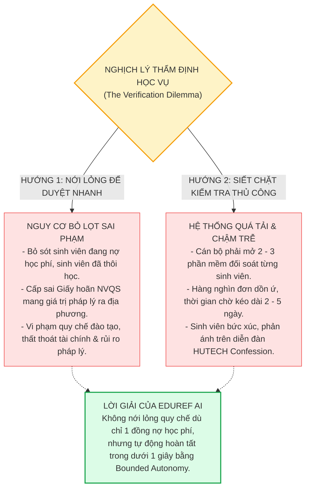
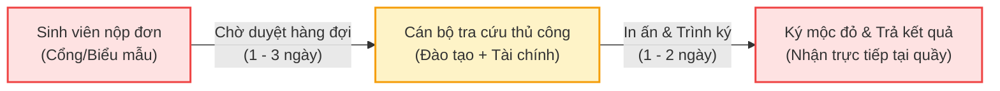
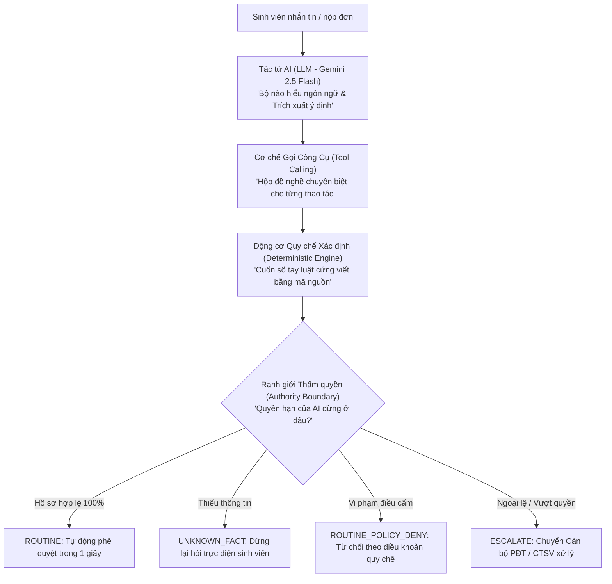
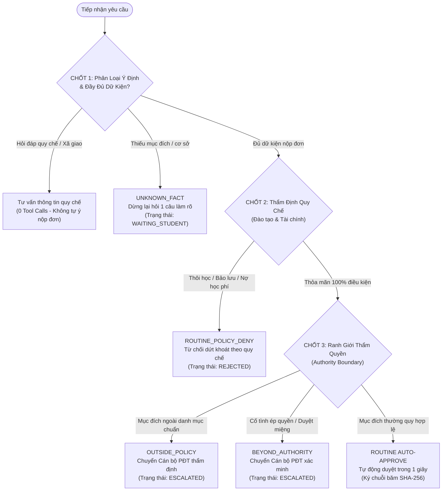
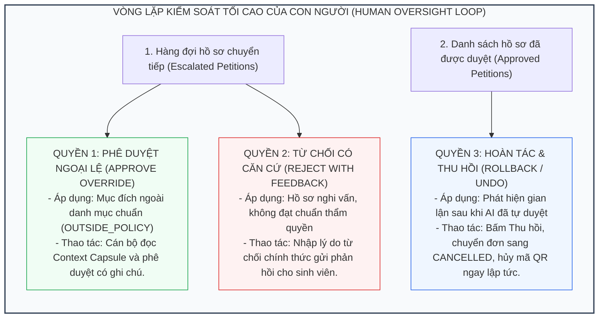
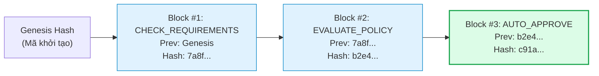
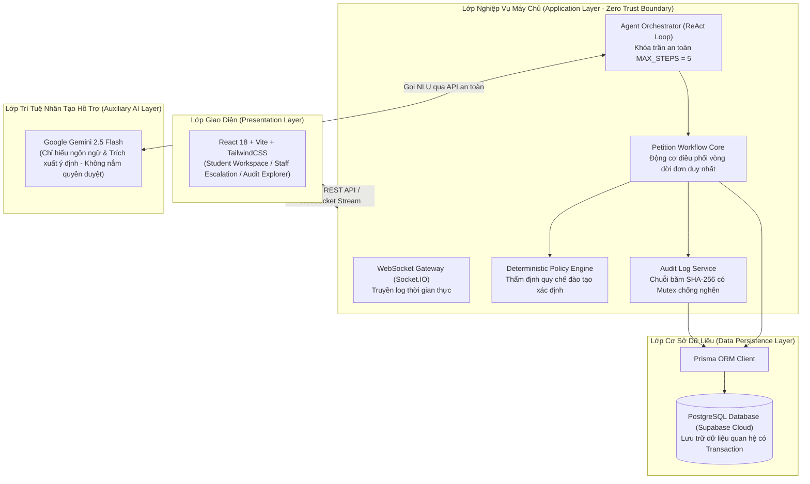

# BÁO CÁO ĐỀ ÁN HỆ THỐNG TRỌNG TÀI TỰ HÀNH THẨM ĐỊNH & ĐIỀU PHỐI HÀNH CHÍNH HỌC VỤ
# EDUREF AI (THE ACADEMIC ESCALATION REFEREE)

**Dự án:** EduRef AI — Autonomous Academic Petition & Escalation Referee  
**Đơn vị thực hiện:** Nhóm Nghiên cứu & Phát triển Dự án EduRef AI (Đội thi KAISER — Khoa Công nghệ Thông tin, Đại học HUTECH)  
**Nhân sự thực hiện:**  
* **Trưởng nhóm:** Cao Hữu Nhân (22DTHE4) — Kỹ sư Tác tử AI & Trưởng nhóm Dự án  
* **Thành viên:** Trần Đức Tài (23DTHD5) — Kỹ sư Backend & Sổ cái Kiểm toán  
* **Thành viên:** Trần Minh Quang (22DTHC7) — Kỹ sư Giao diện & Trải nghiệm Người dùng  
**Thời gian hoàn thành:** Tháng 10/2026  
**Phiên bản tài liệu:** 2.1 (Báo Cáo Nghiệm Thu Kỹ Thuật & Cập Nhật Nghiệp Vụ Thực Tế Phòng CTSV HUTECH)  

---

## TỔNG QUAN DỰ ÁN

Xuất phát điểm của dự án không phải từ một ý tưởng công nghệ thuần túy trong phòng thí nghiệm, mà bắt đầu từ chính những quan sát thực tế trong đời sống học đường: Trên các diễn đàn sinh viên (*HUTECH Confession, các hội nhóm sinh viên các khóa*), cứ đến mỗi mùa cao điểm, xuất hiện rất nhiều bài đăng trăn trở, lo âu:
> *"Ban Chỉ huy Quân sự phường/xã đã gửi giấy triệu tập khám, yêu cầu nộp bổ sung giấy xác nhận trước thứ Sáu mà đơn xin Giấy xác nhận sinh viên tạm hoãn Nghĩa vụ Quân sự nộp cả tuần nay vẫn ở trạng thái 'Đang xử lý', phải làm sao?"*  
> *"Tại sao đơn xin giấy xác nhận bị từ chối mà hệ thống không hề giải thích lý do cụ thể là vì sao?"*

Đằng sau những phản ánh đó là một bài toán hóc búa đối với công tác quản trị đại học. Trong tiến trình chuyển đổi số, Nhà trường luôn mong muốn tự động hóa thủ tục để phục vụ sinh viên nhanh nhất. Tuy nhiên, khi đưa Trí tuệ nhân tạo (AI) hay các hệ thống tự động vào quy trình học vụ mang tính pháp trị, Nhà trường phải đối mặt với một nghịch lý lớn: **AI càng tự do trả lời thì nguy cơ bịa đặt thông tin (Hallucination), vượt quyền phê duyệt hoặc bị sinh viên lách luật (Prompt Injection) càng cao.**

Nhận thức sâu sắc vấn đề này, dự án **EduRef AI** được nghiên cứu và phát triển nhằm xây dựng một hệ thống **Tác tử AI Tự hành có Kiểm soát (Bounded Autonomy Agent)** đóng vai trò như một **"Trọng tài Học vụ Số"**. 

Báo cáo này trình bày toàn diện về mục tiêu, giải pháp kỹ thuật, cơ chế vận hành thực tế và tiềm năng ứng dụng của EduRef AI. Toàn bộ nội dung trong tài liệu được đối chiếu trực tiếp từ mã nguồn thực tế và kết quả đo kiểm thực nghiệm của hệ thống.

---

## 1. ĐẶT VẤN ĐỀ: NHỮNG NỖI ĐAU THỰC TẾ & NGHỊCH LÝ TRONG QUẢN TRỊ HỌC VỤ

Hằng năm, Phòng Đào tạo (PĐT) và Phòng Công tác Sinh viên (CTSV) tiếp nhận hàng chục nghìn lượt yêu cầu hành chính từ sinh viên. Trong đó, thủ tục **Cấp Giấy Xác Nhận Sinh Viên** (đặc biệt là tạm hoãn nghĩa vụ quân sự, vay vốn ngân hàng chính sách, làm vé xe buýt, xin học bổng, visa, giảm trừ gia cảnh thuế TNCN...) là thủ tục phát sinh liên tục với tần suất dày đặc và áp lực thời gian lớn nhất.

### 1.1. Nghịch lý Thẩm định Học vụ (The Verification Dilemma): Thả lỏng thì lọt vi phạm — Siết chặt thì nghẽn thời gian

Công tác tiếp nhận và duyệt đơn truyền thống luôn bị đặt vào một thế tiến thoái lưỡng nan:



1. **Nếu nới lỏng quy trình (để duyệt nhanh cho kịp hạn nộp của sinh viên):**
   * Nguy cơ bỏ lọt các trường hợp chưa hoàn thành học phí, sinh viên đang trong thời gian đình chỉ (`SUSPENDED`) hoặc đã bị xóa tên thôi học (`DROPPED`).
   * Đặc biệt đối với **Giấy xác nhận tạm hoãn Nghĩa vụ Quân sự**, đây là văn bản có giá trị pháp lý gửi trực tiếp tới Ban Chỉ huy Quân sự quận/huyện. Nếu cấp khống hoặc cấp sai đối tượng, Nhà trường sẽ chịu trách nhiệm pháp lý rất nghiêm trọng trước cơ quan quản lý nhà nước.
2. **Nếu siết chặt quy trình (để đảm bảo thượng tôn quy chế):**
   * Cán bộ buộc phải mở từng phần mềm đối soát: phần mềm tài chính kiểm tra nợ học phí, phần mềm đào tạo kiểm tra tiến độ học tập và tình trạng kỷ luật.
   * Với quy mô hơn 40.000 sinh viên, vào các đợt cao điểm triệu tập NVQS của địa phương (tháng 9 – tháng 11) hoặc đợt vay vốn sinh viên, hàng nghìn đơn dồn về cùng lúc khiến hàng đợi tê liệt. Thời gian chờ đợi kéo dài từ **2 đến 5 ngày làm việc**, khiến sinh viên hoang mang vì sát hạn nộp phạt của Ban Chỉ huy Quân sự địa phương.

### 1.2. Ba nút thắt lớn trong quy trình hiện tại



* **Nút thắt 1 — Quá tải xử lý thủ công các hồ sơ thường quy:** Hơn 70% hồ sơ gửi về là hoàn toàn hợp lệ. Cán bộ vẫn mất thời gian kiểm tra lặp đi lặp lại những thao tác tra cứu đơn giản, làm tiêu tốn hàng trăm giờ làm việc mỗi học kỳ.
* **Nút thắt 2 — Thiếu thông tin & Không rõ nguyên nhân từ chối:** Sinh viên nộp đơn nhưng quên ghi rõ mục đích cụ thể hoặc chưa chọn nơi nhận bản cứng. Khi bị từ chối, hệ thống chỉ báo chung chung "Không hợp lệ" mà không giải thích điều khoản vi phạm, khiến sinh viên hoang mang và nảy sinh tâm lý tiêu cực.
* **Nút thắt 3 — Rủi ro khi ứng dụng AI thông thường:** Các chatbot tự do rất dễ bị ảo tưởng (*hallucination*), dễ bị sinh viên dùng chiêu trò câu lệnh (*prompt injection* như viện dẫn "Trưởng phòng đã đồng ý miệng") đánh lừa để tự tiện phê duyệt sai quy chế.

---

## 2. EDUREF AI LÀ GÌ VÀ DÀNH CHO AI?

### 2.1. Định nghĩa hệ thống
**EduRef AI (The Academic Escalation Referee)** không phải là một Chatbot tán gẫu thông thường, mà là một **Hệ thống Trọng tài Tự hành Thẩm định & Điều phối Học vụ**. Hệ thống vận hành theo nguyên lý **Tự chủ trong ranh giới (Bounded Autonomy)**:
* **Tự chủ xử lý:** Những hồ sơ chuẩn mực, đầy đủ dữ kiện và nằm trong quy định sẽ được hệ thống thẩm định và phê duyệt tự động ngay lập tức ($< 1.0$ giây).
* **Biết dừng lại đúng lúc:** Khi gặp trường hợp thiếu thông tin, AI dừng lại hỏi sinh viên. Khi gặp trường hợp vượt thẩm quyền, có dấu hiệu gian lận hoặc ngoài quy chế, AI lập tức **dừng tự động hóa**, đóng gói toàn bộ ngữ cảnh và chuyển tiếp lên cán bộ nhân sự có thẩm quyền (Human-in-the-loop).

```
                      ┌────────────────────────────────────────┐
                      │          EDUREF AI PLATFORM            │
                      └──────────────────┬─────────────────────┘
                                         │
         ┌───────────────────────────────┼───────────────────────────────┐
         ▼                               ▼                               ▼
     SINH VIÊN                 CÁN BỘ PHÒNG ĐT / CTSV            BAN QUẢN LÝ NHÀ TRƯỜNG
 • Nộp đơn & chat 24/7        • Giảm 80% áp lực giấy tờ       • Minh bạch trách nhiệm 100%
 • Nhận kết quả tức thì       • Chỉ xử lý ca khó / ngoại lệ   • Sổ cái SHA-256 chống chỉnh sửa
 • Hướng dẫn quy chế rõ ràng  • Nhận tóm tắt Context Capsule  • Giám sát thời gian thực
```

### 2.2. Đối tượng phục vụ
1. **Sinh viên:** Nhận kết quả phê duyệt học vụ tức thì ($< 1.0$s), cấp mã công văn chứng thực số `XNSV-XXXXXX` và lịch hẹn nhận bản cứng có chữ ký sống & mộc đỏ Nhà trường tại Phòng CTSV (A-01.01 Sài Gòn hoặc E1-01.08 Thủ Đức).
2. **Cán bộ phụ trách Học vụ / Công tác Sinh viên:** Được giải phóng khỏi các thao tác nhập liệu, tra cứu lặp đi lặp lại; chỉ cần tập trung phán quyết các ca ngoại lệ được hệ thống lọc sẵn.
3. **Ban Quản trị & Lãnh đạo Nhà trường:** Kiểm soát toàn diện tính tuân thủ quy chế, theo dõi nhật ký kiểm toán bất biến chống gian lận dữ liệu.

---

## 3. QUY TRÌNH NGHIỆP VỤ: TRƯỚC VÀ SAU KHI ỨNG DỤNG EDUREF AI

| Tiêu chí đối chiếu | Quy trình Thủ công Hiện tại | Quy trình Ứng dụng EduRef AI |
| :--- | :--- | :--- |
| **Kênh tiếp nhận** | Web một chiều. | Giao diện Hội thoại Thông minh (Conversational UI) hỗ trợ 24/7, bóc tách dữ liệu tự động. |
| **Thời gian giải quyết đơn thường quy** | **2 – 5 ngày làm việc** (do thời gian chờ duyệt trong hàng đợi). | **Dưới 1.0 giây** (hệ thống tự động tra cứu CSDL và phê duyệt). |
| **Kiểm tra điều kiện quy chế** | Cán bộ mở từng màn hình tra cứu nợ học phí và trạng thái sinh viên. | Động cơ Quy chế (Deterministic Policy Engine) đối soát tự động theo thời gian thực. |
| **Xử lý hồ sơ thiếu thông tin** | Đơn bị ngâm, cán bộ gửi email/gọi điện hỏi lại, kéo dài nhiều ngày. | AI dừng lại, đặt đúng **1 câu hỏi trực diện** ngay trong phiên chat để sinh viên bổ sung. |
| **Xử lý trường hợp ngoại lệ** | Dễ sót việc, không có hồ sơ tóm tắt, cán bộ phải đọc lại từ đầu. | Đóng gói **Context Capsule** chuyển thẳng vào hàng đợi Cán bộ kèm câu hỏi gợi ý hành động. |
| **Tính minh bạch & Lưu vết** | Ghi log cơ sở dữ liệu thông thường, có thể bị xóa/sửa nếu bị can thiệp. | **Sổ cái mã băm SHA-256 liên kết chuỗi (Hash Chain)**, bảo đảm tính bất biến tuyệt đối. |

---

## 4. CƠ CHẾ HOẠT ĐỘNG CỦA AI AGENT DƯỚI GÓC NHÌN DỄ HIỂU

Để người quản lý không cần hiểu sâu về thuật toán vẫn nắm vững bản chất, hệ thống được vận hành dựa trên 4 khái niệm nền tảng:



### 4.1. Giải thích các khái niệm kỹ thuật bằng hình tượng đời thường

1. **AI Agent (Tác tử AI):** Giống như một **chuyên viên tiếp nhận thông minh** ngồi tại quầy số 1. Tác tử này có khả năng lắng nghe câu hỏi bằng ngôn ngữ tự nhiên của sinh viên, hiểu được mong muốn, nhận diện tiếng lóng học vụ, nhưng **không có quyền tự tiện quyết định ngoài quy định**.
2. **Tool Calling (Kích hoạt công cụ):** Tác tử AI không tự suy đoán số liệu trong đầu. Khi cần làm việc, nó dùng "hộp đồ nghề" được lập trình sẵn: mở công cụ tra cứu hồ sơ (`get_student_profile`), mở công cụ kiểm tra điều kiện (`check_requirements`), hoặc kích hoạt công cụ xử lý đơn nhanh (`process_student_confirmation`).
3. **Deterministic Policy Engine (Động cơ quy chế xác định):** Đây là **"Cuốn sổ tay quy chế đào tạo"** được viết bằng mã lệnh cứng (Hardcoded Logic) độc lập hoàn toàn với AI. Dù sinh viên có dùng lời lẽ thuyết phục hay kỹ thuật jailbreak, quyết định cuối cùng vẫn do cuốn sổ tay này phán quyết. AI tuyệt đối không được tự suy diễn luật.
4. **Authority Boundary (Ranh giới thẩm quyền):** Phân cấp quyền lực rõ ràng: AI chỉ là "nhân viên cấp 1", chỉ được phép tự duyệt các đơn thường quy nằm trong danh mục cho phép. Mọi trường hợp ngoại lệ đều vượt quá thẩm quyền của AI.
5. **Human-in-the-loop (Con người can thiệp):** Khi AI chạm ranh giới thẩm quyền, nó đóng vai trò "thư ký chuyên trách": gom toàn bộ thông tin quan trọng, tóm tắt lý do và chuyển lên bàn làm việc của Cán bộ để con người ra quyết định.

---

## 5. CƠ CHẾ PHÁN QUYẾT: 3 CHỐT CHẶN & 4 HƯỚNG XỬ LÝ

Mọi tương tác của sinh viên đều phải đi qua **Cơ chế 3 Chốt Kiểm Soát Nghiêm Ngặt** trước khi bất kỳ hành động nào được thực thi:



### Chi tiết 4 hướng quyết định của hệ thống:

| Tình huống | Dấu hiệu nhận diện | Hành vi của Hệ thống | Trách nhiệm giải trình |
| :--- | :--- | :--- | :--- |
| **1. Tự động phê duyệt (`ROUTINE`)** | Sinh viên `ACTIVE`, có TKB/tín chỉ học kỳ này, biểu mẫu khớp với mục đích và nằm trong danh mục 5 biểu mẫu chuẩn (`TAX_DEDUCTION`, `BANK_LOAN`, `MILITARY_DEFERMENT`, `COURSE_DEBT`, `GENERAL_CONFIRMATION`), đầy đủ nơi nhận. | Tự động phê duyệt trong **$< 1.0$ giây**, cấp mã công văn nội bộ (ví dụ: `XNSV-954839`), lưu hồ sơ sổ công văn CTSV và hướng dẫn sinh viên đến nhận bản cứng có mộc đỏ và chữ ký sống tại Phòng CTSV. | Ghi nhận bản ghi kiểm toán kèm mã băm SHA-256 và điều khoản quy chế áp dụng. |
| **2. Dừng để hỏi bổ sung (`UNKNOWN_FACT`)** | Sinh viên thiếu thông tin bắt buộc (chưa nêu cơ quan tiếp nhận, thiếu danh sách môn nợ đối với Form nợ môn) hoặc **phát hiện lệch biểu mẫu** (`Cross-Form Mismatch`). | **Dừng tự động hóa ngay lập tức**, chuyển trạng thái đơn sang `WAITING_STUDENT`, hướng dẫn sinh viên 2 cách: điền form bên trái hoặc nhắn tin trực tiếp qua chat để AI điền giúp. | Không tạo đơn rác; giữ trạng thái chờ cho đến khi nhận đủ thông tin. |
| **3. Từ chối theo quy chế (`ROUTINE_POLICY_DENY`)** | Sinh viên đã thôi học (`DROPPED`), đang bảo lưu (`SUSPENDED`), không có TKB học kỳ hiện tại, hoặc sinh viên đang nợ môn xin Giấy NVQS thông thường (chưa chuyển sang Form Nợ môn). | **Từ chối dứt khoát**, trích dẫn cụ thể điều khoản quy chế đào tạo, hướng dẫn chuyển sang biểu mẫu nợ môn hoặc liên hệ Phòng Đào tạo / CTSV. | Lý do từ chối rõ ràng, minh bạch căn cứ, ngăn ngừa khiếu nại. |
| **4. Chuyển tiếp Cán bộ (`ESCALATE_TO_STAFF`)** | Mục đích sử dụng hợp lý nhưng ngoài quy chế, xin cấp lại lần 2 trong cùng kỳ vì lý do mất giấy/cơ quan yêu cầu, hoặc sinh viên khai *"Lãnh đạo đã đồng ý miệng"*, có dấu hiệu ép quyền. | **Dừng tự động hóa**, đóng gói toàn bộ hồ sơ thành **Context Capsule** gửi về hàng đợi của Cán bộ PĐT/CTSV kèm câu hỏi gợi ý hành động. | Bảo vệ ranh giới tự chủ của AI; con người giữ quyền quyết định tối cao. |

---

### 5.1. Nghiệp Vụ Chuẩn 5 Biểu Mẫu Học Vụ Thực Tế HUTECH (CTSV Guidelines)

Theo chỉ đạo nghiệp vụ từ Thầy Quản lý Phòng Công tác Sinh viên (CTSV), hệ thống được chuẩn hóa toàn diện 5 biểu mẫu hành chính:

1. **`TAX_DEDUCTION` — Đơn xin xác nhận giảm trừ gia cảnh Thuế TNCN:** Bắt buộc có thông tin Cơ quan Thuế / Nơi tiếp nhận; thời hạn giá trị 1 học kỳ.
2. **`BANK_LOAN` — Đơn xin xác nhận vay vốn Ngân hàng CSXH:** Mẫu 01/TDSV theo Phụ lục Thông tư 27/2019/TT-NHCS, bắt buộc địa chỉ thường trú 4 cấp Title Case, thời hạn 1 học kỳ.
3. **`MILITARY_DEFERMENT` — Đơn xin tạm hoãn Nghĩa vụ Quân sự:** Bắt buộc có Ban Chỉ huy Quân sự cấp Xã/Phường/Thị trấn tiếp nhận; thời hạn hiệu lực nghiêm ngặt 30 ngày (1 tháng) theo Luật Nghĩa vụ Quân sự.
4. **`COURSE_DEBT` — Đơn xin xác nhận sinh viên còn nợ môn / Kéo dài tiến độ:** Dành riêng cho sinh viên đã quá 4 năm đào tạo chuẩn ($> 4$ năm) nhưng vẫn còn môn học/tín chỉ chưa hoàn thành. Bắt buộc liệt kê danh sách môn nợ và thời hạn dự kiến hoàn thành.
5. **`GENERAL_CONFIRMATION` — Đơn xin xác nhận sinh viên thông thường:** Dùng cho các mục đích: làm vé tháng xe buýt, xin visa du lịch, bổ sung hồ sơ xin việc, thuê nhà... Hiệu lực 1 học kỳ.

---

## 6. VAI TRÒ CỦA CON NGƯỜI (HUMAN-IN-THE-LOOP & OVERSIGHT)

EduRef AI được thiết kế với triết lý **"AI hỗ trợ — Con người làm chủ"**. Hệ thống không bao giờ coi quyết định của AI là phán quyết tuyệt đối không thể thay đổi, mà trao trọn quyền kiểm soát tối cao cho Cán bộ và Lãnh đạo qua **3 quyền năng cốt lõi**:



### 6.1. Hàng đợi Xử lý Hồ sơ Chuyển tiếp (Escalation Hub)
Khi một hồ sơ bị chuyển tiếp (`ESCALATED`), Cán bộ không cần phải lục lại toàn bộ lịch sử trò chuyện dài dòng. Hệ thống tự động tạo ra một **Hộp Ngữ Cảnh (Context Capsule)** trên màn hình làm việc của cán bộ:
* **Tóm tắt sự vụ:** Ai nộp? Nộp làm gì? Trạng thái học vụ ra sao?
* **Lý do AI dừng lại:** Nêu rõ vi phạm ranh giới nào (ví dụ: *Mục đích ngoài quy chế V1.0.0* hoặc *Viện dẫn lãnh đạo đồng ý miệng*).
* **Câu hỏi hành động trực diện:** Ví dụ: *"Cán bộ có chấp thuận cấp giấy xác nhận cho mục đích bảo lãnh mua xe trả góp không?"*
* **Thao tác 1-Click:** Cán bộ chỉ cần chọn **[Phê Duyệt Ngoại Lệ]** (kèm ghi chú) hoặc **[Từ Chối]** (kèm lý do).

```
┌────────────────────────────────────────────────────────────────────────┐
│ HỒ SƠ CHUYỂN TIẾP: XNSV-482910                                         │
│ Sinh viên: Cao Hữu Nhân (MSSV: 2280602154) - Khoa CNTT                 │
├────────────────────────────────────────────────────────────────────────┤
│ Lý do chuyển tiếp: Mục đích [Bảo lãnh thuê nhà] chưa nằm trong danh    │
│ danh mục thường quy (Policy Scope Allowlist).                          │
│ Câu hỏi hành động: Cán bộ PĐT có đồng ý cấp giấy xác nhận cho mục      │
│ đích đặc thù này không?                                                │
├────────────────────────────────────────────────────────────────────────┤
│ [ Ghi chú cán bộ: ....................................... ]            │
│                 [ TỪ CHỐI ]          [ PHÊ DUYỆT NGOẠI LỆ ]            │
└────────────────────────────────────────────────────────────────────────┘
```

### 6.2. Cơ chế Can thiệp & Thu hồi Giao dịch (Human Override Rollback)
* Trong trường hợp phát hiện sinh viên có dấu hiệu gian lận sau khi đã được tự động duyệt, hoặc theo yêu cầu đột xuất từ cơ quan chức năng, Cán bộ hoặc Trưởng phòng có thể bấm nút **Thu hồi (Rollback)**.
* Khi lệnh Rollback được kích hoạt:
  1. Trạng thái đơn lập tức chuyển thành `CANCELLED`.
  2. Mã QR chứng thực số bị vô hiệu hóa.
  3. Một bản ghi kiểm toán mới được tạo và ký mã băm SHA-256 ghi rõ: *Người thu hồi, Thời điểm, Lý do thu hồi*.

---

## 7. TÍNH MINH BẠCH & SỔ CÁI KIỂM TOÁN MẬT MÃ (CRYPTOGRAPHIC AUDIT LEDGER)

Điểm khác biệt vượt trội của EduRef AI so với các phần mềm quản lý học vụ hiện nay là tính năng **Sổ cái kiểm toán chuỗi băm (SHA-256 Hash Chain)**:



1. **Liên kết bất biến (Tamper-evident):** Mỗi hành động (từ kiểm tra điều kiện, thẩm định quy chế, phê duyệt cho đến thu hồi) đều được băm thành một chuỗi SHA-256 và liên kết với mã băm của bản ghi trước đó (`Block_N.previousHash = Block_{N-1}.sha256Hash`).
2. **Chống sửa đổi dữ liệu hồi tố:** Nếu bất kỳ ai can thiệp trực tiếp vào cơ sở dữ liệu để sửa điểm, sửa nợ học phí hoặc sửa kết quả duyệt, toàn bộ chuỗi băm phía sau sẽ bị gãy và hệ thống lập tức phát hiện cảnh báo toàn vẹn.
3. **Lưu trữ nguyên tử (Atomic Mutation):** Bản ghi nghiệp vụ và bản ghi kiểm toán được thực thi trong cùng một Giao dịch cơ sở dữ liệu nguyên tử (Database Transaction). Nếu việc ghi nhật ký kiểm toán thất bại, quyết định nghiệp vụ cũng sẽ tự động bị hủy, đảm bảo không bao giờ có quyết định không hợp lệ lọt qua hệ thống mà thiếu vết tích lưu trữ.
4. **Trang tra cứu trực quan (Audit Explorer):** Đội ngũ thanh tra và quản lý có thể mở trực tiếp màn hình Khám phá Sổ cái Kiểm toán (Audit Explorer) để kiểm tra tính toàn vẹn của chuỗi băm bất kỳ lúc nào với một cú nhấp chuột.

---

## 8. CÁC PHÂN HỆ CHỨC NĂNG CHÍNH VÀ TRẢI NGHIỆM THỰC TẾ

Hệ thống được tổ chức thành 4 phân hệ giao diện chuyên biệt:

```
┌────────────────────────────────────────────────────────────────────────┐
│                        EDUREF AI WEB PLATFORM                          │
├───────────────────┬───────────────────┬────────────────────────────────┤
│    SINH VIÊN      │   CÁN BỘ PĐT      │       GIÁM SÁT & KIỂM TOÁN     │
├───────────────────┼───────────────────┼────────────────────────────────┤
│ 1. Không gian làm │ 2. Hàng đợi       │ 3. Khám phá Sổ cái             │
│    việc Sinh viên │    Chuyển tiếp    │    Kiểm toán                   │
│    (Student       │    (Staff         │    (Audit Explorer)            │
│    Workspace)     │    Escalation)    │                                │
│                   │                   ├────────────────────────────────┤
│ • Chatbot AI 24/7 │ • Hàng đợi đơn    │ 4. Hệ thống Kiểm thử Tự hành   │
│ • Nộp biểu mẫu    │ • Phê duyệt       │    (Verify Harness)            │
│ • Xem đơn của tôi │   1-Click         │ • Chạy 5 ca chuẩn đề bài       │
│ • Nhận mã QR      │ • Thu hồi đơn     │ • Live Terminal Console        │
└───────────────────┴───────────────────┴────────────────────────────────┘
```

1. **Không gian làm việc Sinh viên (Student Workspace):**
   * Cho phép sinh viên đăng nhập, trò chuyện tự nhiên với Trợ lý AI hoặc điền biểu mẫu nhanh.
   * AI tự động nhận diện danh tính từ phiên đăng nhập, hướng dẫn chọn cơ sở nhận giấy (Cơ sở Sài Gòn hoặc Cơ sở Thủ Đức), và trả kết quả có mã chứng thực trong tích tắc.
2. **Không gian Xử lý của Cán bộ (Staff Escalation Hub):**
   * Hiển thị danh sách các hồ sơ bị hệ thống chặn lại cần ý kiến chuyên môn (`ESCALATED`).
   * Phân loại trực quan: Ca ngoài danh mục quy chế (`OUTSIDE_POLICY`), Ca yêu cầu vượt quyền (`BEYOND_AUTHORITY`).
   * Cung cấp nút Duyệt ngoại lệ, Từ chối kèm lý do và chức năng Thu hồi hồ sơ (Rollback).
3. **Cổng Khám phá Sổ cái Kiểm toán (Audit Explorer):**
   * Minh bạch hóa toàn bộ các khối dữ liệu mã băm SHA-256 liên kết chuỗi.
   * Cho phép tra cứu theo mã đơn, vai trò người thực hiện (AI, Sinh viên, Cán bộ) và bấm nút kiểm tra tính toàn vẹn chuỗi dữ liệu.
4. **Hệ thống Kiểm thử Tự hành (Verify Harness):**
   * Được thiết kế chuyên biệt phục vụ công tác thanh kiểm tra và nghiệm thu phần mềm trực tiếp.
   * Cung cấp nút bấm chạy tự động 5 kịch bản chuẩn mực kèm màn hình theo dõi dòng dữ liệu trực tiếp (Live Terminal Console) cập nhật theo thời gian thực.

---

## 9. KIẾN TRÚC KỸ THUẬT & CÔNG NGHỆ SỬ DỤNG

### 9.1. Sơ đồ kiến trúc phân tầng (Clean Multi-Tier Architecture)



### 9.2. Bảng phân công vai trò của các công nghệ

| Thành phần | Công nghệ lựa chọn | Vai trò kỹ thuật & Lý do lựa chọn |
| :--- | :--- | :--- |
| **Giao diện người dùng** | React 18, Vite, TailwindCSS | Tốc độ tải trang cực nhanh, giao diện hiện đại, tính tương tác thời gian thực cao. |
| **Giao tiếp thời gian thực** | Socket.IO | Truyền phát từng bước suy nghĩ của AI và nhật ký kiểm toán trực tiếp lên màn hình mà không cần tải lại trang. |
| **Máy chủ nghiệp vụ** | Node.js (ES Modules), Express | Hiệu năng xử lý I/O bất đồng bộ vượt trội, kiến trúc module hóa rõ ràng, dễ bảo trì. |
| **Bộ não ngôn ngữ** | Google Gemini 2.5 Flash | Khả năng hiểu tiếng Việt xuất sắc, tốc độ phản hồi cực nhanh (~200ms TTFB), chi phí vận hành tối ưu. |
| **Quy chế & Nghiệp vụ** | Javascript Pure Engine | Đảm bảo tính xác định (Deterministic), 100% tuân thủ luật lệ, không phụ thuộc vào độ trễ hay tính ngẫu nhiên của AI. |
| **Cơ sở dữ liệu & ORM** | PostgreSQL, Prisma ORM, Supabase | Hệ quản trị cơ sở dữ liệu quan hệ mạnh mẽ, đảm bảo tính toàn vẹn dữ liệu (ACID) và hỗ trợ giao dịch phức tạp. |
| **Bảo mật & Kiểm toán** | SHA-256, JWT, RBAC, Mutex | Chuỗi băm mật mã học chống chỉnh sửa dữ liệu, phân quyền 4 vai trò chặt chẽ, triệt tiêu xung đột ghi log đồng thời. |

> **Nguyên lý An ninh then chốt (Zero-Trust Client Boundary):**  
> Toàn bộ logic ra quyết định, kiểm tra quyền hạn và đối soát dữ liệu đều được đóng gói an toàn tại Máy chủ (Backend). Trình duyệt của sinh viên chỉ đóng vai trò hiển thị và gửi dữ liệu thô. Sinh viên không thể can thiệp hay sửa đổi phán quyết thông qua các công cụ can thiệp mã nguồn trình duyệt (DevTools/F12).

---

## 10. ĐỐI CHIẾU TRUNG THỰC: THIẾT KẾ BAN ĐẦU VÀ HỆ THỐNG THỰC TẾ (TRANSPARENCY NOTES)

Với tinh thần trung thực khoa học, các điểm khác biệt giữa tài liệu thiết kế ban đầu và hệ thống thực tế đang vận hành trong dự án được ghi nhận rõ ràng:

1. **Phạm vi thủ tục hành chính:**
   * *Trong thiết kế ban đầu:* Có đề cập đến 4 loại thủ tục (xác nhận sinh viên, xét tốt nghiệp, vay vốn ngân hàng, hoãn nghĩa vụ quân sự).
   * *Trong hệ thống hiện tại:* Dự án đã **tập trung tối đa và giải quyết trọn vẹn 1 thủ tục duy nhất là Cấp Giấy Xác Nhận Sinh Viên**. Các mục đích vay vốn, hoãn nghĩa vụ quân sự, làm vé xe buýt, xin visa, bổ sung hồ sơ... được chuẩn hóa thành các mục đích cụ thể của cùng một quy trình cấp giấy theo đúng định hướng tối ưu hóa quy trình.
2. **Phân cấp thẩm quyền xét duyệt:**
   * *Trong thiết kế ban đầu:* Đề cập đến 2 cấp duyệt cán bộ gồm Chuyên viên và Trưởng Đơn vị.
   * *Trong hệ thống hiện tại:* Kiến trúc hệ thống đã sẵn sàng cho cả hai vai trò; tuy nhiên, đối với thủ tục cấp Giấy xác nhận sinh viên, toàn bộ các ca ngoại lệ hiện được định tuyến tập trung về Chuyên viên phụ trách để giải quyết nhanh chóng, phù hợp với thực tế phân công nhiệm vụ tại trường.
3. **Cơ chế vận hành giữa Kiểm thử và Trò chuyện:**
   * *Trên giao diện Kiểm thử Nghiệm thu:* Bộ 5 kịch bản chuẩn mực được xử lý trực tiếp qua Động cơ Quy chế nội bộ nhằm bảo đảm tốc độ phản hồi tức thì ($< 1$ giây) và kết quả xác định chính xác 100% phục vụ nghiệm thu.
   * *Trên giao diện Trò chuyện của sinh viên:* Hệ thống kết nối mô hình trí tuệ nhân tạo Google Gemini 2.5 Flash thông qua Bộ điều phối Tác tử trung tâm để giao tiếp ngôn ngữ tự nhiên, hiểu ngữ cảnh và kích hoạt nghiệp vụ thật.
4. **Theo dõi độ chính xác trong điều phối hồ sơ:**
   * Hệ thống tự động ghi nhận các quyết định can thiệp thực tế của cán bộ (phê duyệt ngoại lệ hoặc từ chối) trong quá trình vận hành để làm căn cứ đánh giá độ chính xác, bảo đảm không đưa ra các tỷ lệ giả định 100% khi chưa có dữ liệu đối soát thực tế từ người dùng.
5. **Quy chuẩn Bản cứng & Cơ chế Xác thực Nội bộ:**
   * Thay vì sinh mã QR từ server bên ngoài, theo chỉ đạo thực tế của Phòng CTSV, Nhà trường cấp bản cứng có chữ ký sống và mộc đỏ cho sinh viên nộp các cơ quan nhà nước / ngân hàng. Hệ thống cấp mã công văn `XNSV-XXXXXX` và chuỗi chứng thực số SHA-256 để cán bộ CTSV đối soát và in đóng dấu tức thì tại quầy A-01.01 hoặc E1-01.08.

---

## 11. GIÁ TRỊ THỰC TIỄN & KHẢ NĂNG NHÂN RỘNG / THƯƠNG MẠI HÓA

### 11.1. Giá trị đem lại cho Nhà trường và Tổ chức Giáo dục
1. **Tiết kiệm nguồn lực:** Cắt giảm ước tính **70% – 80%** thời gian sự vụ của cán bộ phụ trách công tác sinh viên, cho phép nhân sự tập trung vào công tác tư vấn chuyên sâu và hỗ trợ sinh viên khó khăn.
2. **Nâng cao sự hài lòng của sinh viên:** Thay vì phải chờ đợi 2–5 ngày, sinh viên nhận được kết quả và mã chứng thực số trong vòng chưa đầy 1 giây.
3. **Minh chứng Chuyển đổi số kiểu mẫu:** EduRef AI là một sản phẩm thực chiến, áp dụng các chuẩn mực công nghệ AI tiên tiến nhất hiện nay (Server-side Agent, Cryptographic Ledger), hoàn toàn có thể trở thành đề án chuyển đổi số tiêu biểu nhân rộng cho toàn trường.

### 11.2. Khả năng mở rộng trong tương lai
* **Mở rộng danh mục thủ tục nội bộ:** Nhờ áp dụng mô hình kiến trúc Handler tách rời (`PetitionWorkflowCore`), hệ thống có thể dễ dàng bổ sung các quy trình mới (Đơn đăng ký phúc khảo, Đơn xin miễn giảm học phí, Đơn xin bảo lưu, Đơn chuyển ngành) bằng cách viết thêm Handler độc lập mà không cần sửa đổi lõi hệ thống.
* **Mô hình Khung làm việc (Framework) cho các trường đại học:** Khái niệm "Trọng tài Học vụ Số Bounded Autonomy" có thể đóng gói thành một giải pháp phần mềm chuyên biệt (SaaS) cung cấp cho các trường đại học, cao đẳng trong cả nước — nơi quy trình hành chính tương đồng nhưng đang thiếu công cụ AI có kiểm soát.

---

## 12. GIỚI HẠN HIỆN TẠI, RỦI RO & HƯỚNG PHÁT TRIỂN

### 12.1. Các giới hạn hiện tại
* **Phụ thuộc vào Cloud API bên ngoài (Google Gemini):** Việc gọi API đám mây phụ thuộc vào đường truyền mạng Internet; nếu API ngoài bị nghẽn, thời gian phản hồi ở tầng giao tiếp có thể bị chậm lại. Đồng thời, việc gửi dữ liệu văn bản ra máy chủ đám mây công cộng tiềm ẩn băn khoăn về quyền riêng tư và chủ quyền dữ liệu giáo dục.
* **Bộ nhớ ngữ cảnh trong RAM:** Phiên trò chuyện ngắn hạn hiện đang lưu trong bộ nhớ tạm của máy chủ dịch vụ; nếu máy chủ khởi động lại, sinh viên sẽ bắt đầu lại phiên hội thoại mới (dữ liệu đơn chính thức trong cơ sở dữ liệu vẫn được lưu trữ an toàn 100%).
* **Cơ chế cập nhật quy chế còn tĩnh:** Các quy định về thời hạn, biểu mẫu và giới hạn thời gian cấp giấy hiện đang được cấu hình cố định bằng mã nguồn. Khi Nhà trường ban hành các thông báo điều chỉnh quy định hay thay đổi thời hạn cấp giấy linh hoạt theo từng đợt cao điểm, hệ thống chưa có cơ chế tự động nạp văn bản chính sách mới vào kho tri thức.

### 12.2. Hướng phát triển tiếp theo (Next Steps & Roadmap)

1. **Triển khai Mô hình Ngôn ngữ Cục bộ (Local LLM via Ollama trên Server Nhà trường):**
   * Chuyển đổi tầng NLU từ Cloud API sang chạy mô hình mã nguồn mở cục bộ (như Llama 3 / Qwen 2.5) thông qua **Ollama** trực tiếp trên hạ tầng máy chủ của Nhà trường (On-premise Private Server / Private GPU).
   * **Lợi ích then chốt:** Đảm bảo **an toàn và bảo mật thông tin tuyệt đối**, lưu trữ toàn bộ dữ liệu sinh viên và hội thoại học vụ trong mạng nội bộ của Trường, triệt tiêu nguy cơ rò rỉ dữ liệu ra Internet và duy trì hệ thống hoạt động ổn định ngay cả khi mất kết nối mạng ngoài.

2. **Tích hợp Kiến trúc RAG (Retrieval-Augmented Generation) & Cơ sở Dữ liệu Vector (Vector Database):**
   * Xây dựng luồng RAG kết hợp Vector DB (như Qdrant / Pgvector / ChromaDB) để quản trị toàn bộ kho văn bản quy chế đào tạo, hướng dẫn học vụ và các thông báo mới của Nhà trường.
   * **Giải quyết bài toán cấp giấy linh động:** Khi Nhà trường cập nhật tài liệu quy chế mới, thay đổi biểu mẫu, hoặc ban hành các mốc thời gian / giới hạn thời gian cấp giấy linh hoạt theo từng giai đoạn (ví dụ: đợt cao điểm NVQS chỉ cấp trong thời hạn 24 giờ, đợt thi kết thúc học phần tạm ngưng cấp giấy...), cán bộ quản trị chỉ cần tải văn bản PDF/Word lên hệ thống. RAG và Vector DB sẽ tự động bóc tách ngữ nghĩa, cập nhật vào kho tri thức để Tác tử AI áp dụng ngay lập tức mà không cần can thiệp chỉnh sửa mã nguồn.

3. **Hoàn thiện Cổng Kiểm Chứng QR Công Khai (Public QR Verification):**
   * Xây dựng trang tra cứu mở công khai trên mạng cho bên thứ ba (Ban Chỉ huy Quân sự địa phương, Ngân hàng chính sách, Công ty xe buýt) dùng camera điện thoại quét mã để xác minh hiệu lực của giấy xác nhận và chuỗi băm SHA-256 mà không cần đăng nhập tài khoản trường.

4. **Vòng lặp Hoàn thiện từ Phản hồi của Cán bộ (Human Feedback Loop):**
   * Tự động thống kê mức độ chuẩn xác dựa trên các thao tác bấm Duyệt ngoại lệ hoặc Thu hồi của Cán bộ trong quá trình vận hành, từ đó định kỳ đề xuất cập nhật các quy định mới vào các phiên bản quy chế tiếp theo.

---

## 13. PROJECT STATUS (BÁO CÁO HIỆN TRẠNG DỰ ÁN)

Bảng tổng hợp trạng thái thực tế của từng phân hệ trong hệ thống:

| Phân hệ / Tính năng | Mức độ hoàn thiện | Hiện trạng vận hành thực tế |
| :--- | :---: | :--- |
| **Lõi Quy chế Thẩm định Trung tâm** | **100% Hoàn thành** | Đã quy tụ toàn bộ luồng thẩm định học vụ về một động cơ quy chế duy nhất, hỗ trợ đầy đủ 5 biểu mẫu chuẩn HUTECH. |
| **Phát hiện Chéo Biểu Mẫu (Cross-Form Mismatch)** | **100% Hoàn thành** | Tự động phát hiện sinh viên chọn nhầm biểu mẫu, hướng dẫn sửa đổi qua form trái hoặc qua chat trực tiếp. |
| **Thẩm định TKB & Quy chế Quá 4 năm** | **100% Hoàn thành** | Bắt buộc có TKB/tín chỉ học kỳ này; chuyển hướng sinh viên quá 4 năm sang biểu mẫu nợ môn / kéo dài tiến độ. |
| **Hệ thống Kiểm toán Chuỗi băm SHA-256** | **100% Hoàn thành** | Ghi nhật ký bất biến, liên kết chuỗi mật mã học, bọc trong giao dịch cơ sở dữ liệu nguyên tử chống tranh chấp dữ liệu. |
| **Khóa trần An toàn Tác tử (Tối đa 5 bước suy luận)** | **100% Hoàn thành** | Cài đặt giới hạn cứng tại bộ điều phối máy chủ, tự động chuyển tiếp hồ sơ lên cán bộ khi chạm ngưỡng để chống lặp vô hạn. |
| **Hàng đợi Xử lý Cán bộ & Thu hồi (Rollback)** | **100% Hoàn thành** | Giao diện thao tác 1 cú nhấp chuột dành cho cán bộ, hỗ trợ nhập ghi chú và vô hiệu hóa đơn tức thì. |
| **Kiểm thử Hệ thống Toàn diện** | **100% Hoàn thành** | Toàn bộ **15 test suites** tự động nội bộ (`trackA-policy`, `cross-form-mismatch`, `demo-auth`, `audit-hash`, `tool-outcome`) đều đạt kết quả tuyệt đối **100% Pass**. |
| **Triển khai Trực tuyến (Live Deployment)** | **100% Hoàn thành** | Giao diện người dùng hoạt động trên Vercel: [https://edu-ref-ai-agent.vercel.app/](https://edu-ref-ai-agent.vercel.app/)<br/>Máy chủ dịch vụ hoạt động trên Render: [https://eduref-ai-agent-1.onrender.com/health](https://eduref-ai-agent-1.onrender.com/health) |
| **Đo lường Mức độ Tin cậy Thực tế** | **Đang hoàn thiện** | Tự động ghi nhận tỷ lệ quyết định dựa trên các thao tác phê duyệt ngoại lệ và thu hồi thực tế của cán bộ khi vận hành. |
| **Chạy Local LLM qua Ollama trên Server trường** | **Kế hoạch tiếp theo** | Kiến trúc module hóa cho phép chuyển đổi kết nối sang mô hình cục bộ nội bộ để bảo mật dữ liệu tuyệt đối. |
| **Quản trị Quy chế Động qua RAG & Vector DB** | **Kế hoạch tiếp theo** | Tích hợp cơ sở dữ liệu Vector để nạp tài liệu quy chế mới và giới hạn thời gian cấp giấy linh hoạt theo văn bản. |

---

## LỜI KẾT

EduRef AI được xây dựng không chỉ để tham gia một cuộc thi công nghệ, mà xuất phát từ chính mong muốn giải quyết một bài toán thực sự nhức nhối trong công tác quản trị học vụ. Bằng việc kiên định với triết lý **"Trọng tài biết dừng — AI tự chủ trong ranh giới"**, dự án khẳng định tính khả thi kỹ thuật cao, độ an toàn pháp lý tuyệt đối và giá trị thực tiễn rõ rệt.

Dự án sẵn sàng cho các giai đoạn thử nghiệm thực tế và mở rộng triển khai tại Nhà trường trong thời gian tới.

---
**NHÓM NGHIÊN CỨU & PHÁT TRIỂN DỰ ÁN EDUREF AI**  
*Đội thi KAISER — Khoa Công nghệ Thông tin, Đại học HUTECH*  